# 📝 Static Task Manager — گزارش آزمایش اول آز مهندسی نرم‌افزار

یک برنامه‌ی مدیریت وظایف (Task Manager) که با HTML، CSS و JavaScript خالص (بدون فریم‌ورک و بدون مرحله‌ی Build) پیاده‌سازی شده است. هدف اصلی این آزمایش، تمرین کار با **Git** و **گردش‌کار مبتنی بر شاخه (Branching Workflow)**، شامل کار با چند مخزن راه‌دور، ایجاد و حل تعارض ادغام، و استقرار خودکار بوده است.

## 🔗 لینک‌ها

| مورد                               | آدرس                                              |
| ---------------------------------- | ------------------------------------------------- |
| 🌐 نسخه‌ی مستقر شده (GitHub Pages) | https://mitra-gh.github.io/static-task-manager/   |
| 🐙 مخزن GitHub                     | https://github.com/mitra-gh/static-task-manager   |
| 🇮🇷 مخزن Hamgit                     | https://hamgit.ir/mitra9595gh/static-task-manager |

---

## ✨ امکانات برنامه

- ➕ افزودن وظیفه‌ی جدید
- ✅ علامت‌گذاری وظیفه به عنوان انجام‌شده (با کلیک روی متن آن)
- 🗑️ حذف وظیفه
- 🔍 جستجوی زنده در متن وظایف
- 🎯 فیلتر وظایف: همه / فعال / انجام‌شده (All / Active / Done)
- 🌙 حالت تاریک (Dark Mode) با دکمه‌ی تغییر تم
- 💾 ذخیره‌سازی وظایف و تمِ انتخابی در `localStorage` مرورگر (با بارگذاری مجدد صفحه حفظ می‌شوند)

### تصاویر برنامه

|                  حالت روشن                   |                 حالت تاریک                 |
| :------------------------------------------: | :----------------------------------------: |
| 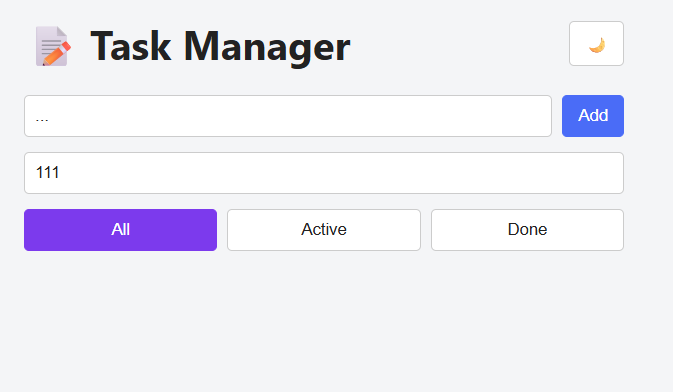 | 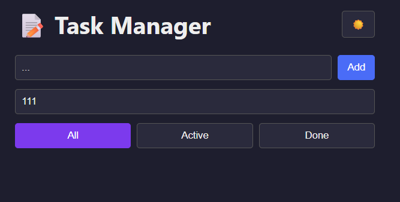 |

---

## 🚀 اجرای پروژه به صورت محلی

این پروژه هیچ وابستگی و مرحله‌ی Build ندارد. برای اجرا کافی است مخزن را دریافت کرده و فایل `index.html` را در مرورگر باز کنید:

```bash
git clone git@hamgit.ir:mitra9595gh/static-task-manager.git
cd static-task-manager
```

---

## 🌿 استراتژی شاخه‌بندی (Branching Strategy)

در این پروژه از یک گردش‌کار مبتنی بر **Git Flow** استفاده شده است:

- تغییرات ابتدا روی **شاخه‌های موضوعی** (feature / style / ci / docs) انجام می‌شوند.
- هر شاخه‌ی موضوعی از طریق **Pull Request** به شاخه‌ی `develop` (شاخه‌ی یکپارچه‌سازی) ادغام می‌شود.
- در پایان، `develop` از طریق یک Pull Request نهایی (Release) به `main` ادغام می‌شود.
- شاخه‌ی `main` محافظت‌شده است (Branch Protection): ادغام مستقیم، force push و حذف شاخه روی آن مجاز نیست و تغییرات صرفاً از طریق Pull Request وارد آن می‌شوند.

### جدول شاخه‌ها

| شاخه                      | نوع          | هدف                                                                       |
| ------------------------- | ------------ | ------------------------------------------------------------------------- |
| `main`                    | اصلی         | نسخه‌ی پایدار و قابل انتشار؛ به صورت خودکار روی GitHub Pages مستقر می‌شود |
| `develop`                 | یکپارچه‌سازی | یکپارچه‌سازی و بررسی تغییرات پیش از انتشار روی `main`                     |
| `feature/project-setup`   | موضوعی       | ساختار اولیه‌ی پروژه: `.gitignore` و اسکلت HTML/CSS/JS                    |
| `feature/task-management` | موضوعی       | منطق اصلی: افزودن، تکمیل و حذف وظایف + ذخیره‌سازی در localStorage         |
| `feature/search-filter`   | موضوعی       | جستجوی زنده و دکمه‌های فیلتر All/Active/Done                              |
| `feature/theme`           | موضوعی       | استایل‌دهی کامل، متغیرهای CSS و حالت تاریک با ذخیره‌ی تم                  |
| `feature/app-title`       | موضوعی       | تغییر عنوان برنامه به «My Task Manager» (طرف اول تعارض ۱)                 |
| `feature/app-title-emoji` | موضوعی       | افزودن ایموجی 📝 به عنوان (طرف دوم تعارض ۱ — تعارض در این شاخه حل شد)     |
| `style/accent-blue`       | موضوعی       | تغییر رنگ تاکیدی فیلتر فعال به آبی تیره (طرف اول تعارض ۲)                 |
| `style/accent-purple`     | موضوعی       | تغییر رنگ تاکیدی به بنفش (طرف دوم تعارض ۲ — تعارض در این شاخه حل شد)      |
| `ci/github-pages`         | موضوعی       | افزودن گردش‌کار GitHub Actions برای استقرار خودکار روی GitHub Pages       |
| `docs/readme`             | موضوعی       | نگارش اولیه‌ی README                                                      |
| `docs/report`             | موضوعی       | گزارش نهایی (سند حاضر)                                                    |

### نمودار جریان شاخه‌ها (ساده‌شده)

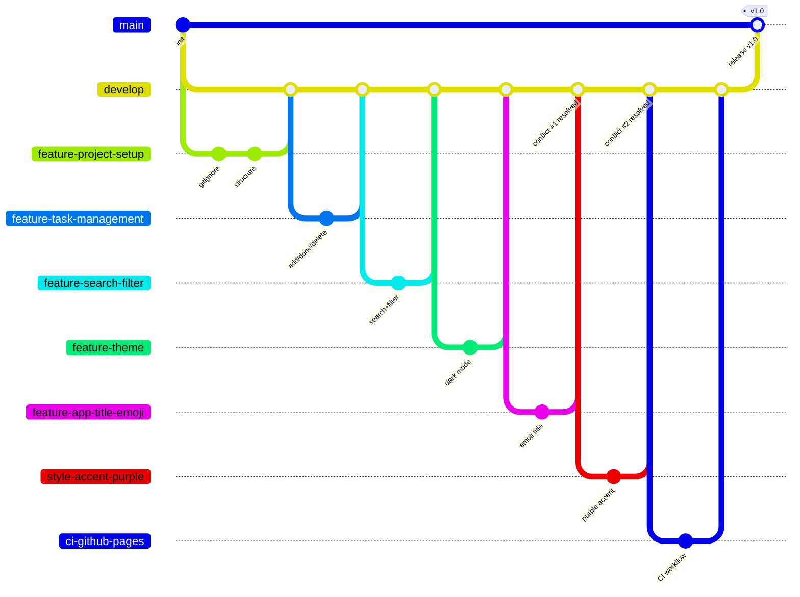

---

## 🔀 جدول Pull Request ها

| PR  | شاخه‌ی مبدأ               | مقصد      | عنوان                                        | توضیح                         |
| --- | ------------------------- | --------- | -------------------------------------------- | ----------------------------- |
| #1  | `feature/project-setup`   | `develop` | feat: project setup                          | ساختار اولیه و `.gitignore`   |
| #2  | `feature/task-management` | `develop` | feat: task management (add/complete/delete)  | منطق اصلی وظایف               |
| #3  | `feature/search-filter`   | `develop` | feat: search and filter tasks                | جستجو و فیلترها               |
| #4  | `feature/theme`           | `develop` | feat: styling and dark mode theme            | استایل و حالت تاریک           |
| #5  | `feature/app-title`       | `develop` | feat: rename app title to My Task Manager    | تغییر عنوان                   |
| #6  | `feature/app-title-emoji` | `develop` | feat: add emoji to app title                 | شامل حل تعارض ۱               |
| #7  | `style/accent-blue`       | `develop` | style: darken accent color for active filter | رنگ آبی                       |
| #8  | `style/accent-purple`     | `develop` | style: use purple accent for active filter   | شامل حل تعارض ۲               |
| #9  | `ci/github-pages`         | `develop` | ci: add GitHub Pages deployment workflow     | گردش‌کار CI/CD                |
| #10 | `docs/readme`             | `develop` | docs: add README                             | نگارش اولیه README            |
| #11 | `develop`                 | `main`    | release: v1.0                                | انتشار نهایی و استقرار خودکار |
| #12 | `docs/report`             | `develop` | docs: add final report                       | گزارش نهایی (سند حاضر)        |

---

## 📜 گزارش کامیت‌ها

- تعداد کل کامیت‌ها: **۳۴**
- خروجی کامل `git log --all --oneline --graph` در فایل [docs/git-log.txt](docs/git-log.txt) قرار دارد.

### خلاصه‌ی مراحل پیاده‌سازی

1. **راه‌اندازی:** ایجاد مخزن با دو remote (گیت‌هاب و همگیت)، ایجاد شاخه‌ی `develop` و فعال‌سازی Branch Protection روی `main`.
2. **ساختار اولیه (PR #1):** افزودن `.gitignore` و اسکلت `index.html`، `css/style.css` و `js/app.js`.
3. **منطق وظایف (PR #2):** در سه کامیت مجزا و اتمیک: افزودن وظیفه و ذخیره‌سازی، تکمیل وظیفه، و حذف وظیفه؛ به همراه استایل اولیه‌ی وظایف انجام‌شده.
4. **جستجو و فیلتر (PR #3):** مارک‌آپ جستجو، منطق فیلتر بر اساس متن، و دکمه‌های All/Active/Done (هر مورد در کامیت جداگانه).
5. **تم و استایل (PR #4):** استایل پایه، متغیرهای CSS و دکمه‌ی حالت تاریک، و ذخیره‌ی تم انتخابی در localStorage.
6. **تعارض‌های کنترل‌شده (PR #5 تا #8):** دو جفت شاخه که یک خط مشترک را تغییر می‌دادند، به منظور تمرین حل دستی تعارض ادغام (شرح در بخش بعد).
7. **CI/CD (PR #9):** گردش‌کار GitHub Actions برای استقرار خودکار روی GitHub Pages.
8. **مستندسازی (PR #10) و انتشار (PR #11):** نگارش README و ادغام نهایی `develop` در `main` که استقرار خودکار را فعال کرد.

---

## ⚔️ گزارش تعارض‌ها (Merge Conflicts)

### تعارض ۱ — عنوان برنامه (`index.html`)

| مورد           | توضیح                                                                                                                                                                                                                                                                                                                                                            |
| -------------- | ---------------------------------------------------------------------------------------------------------------------------------------------------------------------------------------------------------------------------------------------------------------------------------------------------------------------------------------------------------------- |
| شاخه‌های درگیر | `feature/app-title` و `feature/app-title-emoji`                                                                                                                                                                                                                                                                                                                  |
| فایل           | `index.html` (خط `<h1>`)                                                                                                                                                                                                                                                                                                                                         |
| علت            | هر دو شاخه از یک نقطه‌ی مشترک از `develop` منشعب شدند و **یک خط واحد** را به دو شکل متفاوت تغییر دادند: شاخه‌ی اول عنوان را به `My Task Manager` تغییر داد و شاخه‌ی دوم ایموجی 📝 به آن افزود. پس از ادغام شاخه‌ی اول در `develop`، اجرای `git merge develop` روی شاخه‌ی دوم به تعارض منجر شد، زیرا Git امکان تصمیم‌گیری خودکار میان دو تغییر هم‌پوشان را ندارد. |
| روش حل         | حل **دستی**: باز کردن فایل، حذف نشانگرهای تعارض (`<<<<<<<`، `=======`، `>>>>>>>`) و تغییر در یک خط: `<h1>📝 Task Manager</h1>`                                                                                                                                                                                                                                   |
| کامیت حل تعارض | `5b62627` — `merge: resolve title conflict by combining emoji and new title`                                                                                                                                                                                                                                                                                     |

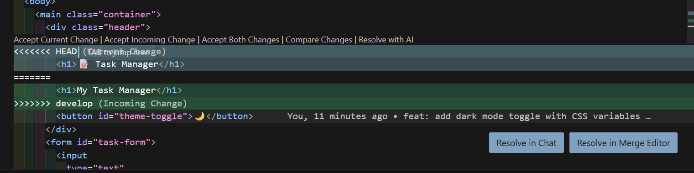

### تعارض ۲ — رنگ تاکیدی (`css/style.css`)

| مورد           | توضیح                                                                                                                                                                                                            |
| -------------- | ---------------------------------------------------------------------------------------------------------------------------------------------------------------------------------------------------------------- |
| شاخه‌های درگیر | `style/accent-blue` و `style/accent-purple`                                                                                                                                                                      |
| فایل           | `css/style.css` (قانون `#filter-buttons button.active`)                                                                                                                                                          |
| علت            | هر دو شاخه **یک قانون CSS واحد** را تغییر دادند: یکی رنگ را به آبی تیره (`#2563eb`) و دیگری به بنفش (`#7c3aed`) تغییر داد. پس از ادغام شاخه‌ی آبی در `develop`، ادغام `develop` در شاخه‌ی بنفش به تعارض منجر شد. |
| روش حل         | حل **دستی**: در این مورد یکی از دو نسخه (بنفش) به عنوان نسخه‌ی نهایی انتخاب و نسخه‌ی آبی کنار گذاشته شد.                                                                                                         |
| کامیت حل تعارض | `88f94ba` — `merge: resolve accent color conflict in favor of purple`                                                                                                                                            |

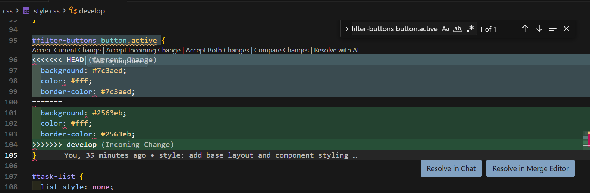

---

## ⚙️ CI/CD — استقرار خودکار با GitHub Actions

فایل گردش‌کار در مسیر [`.github/workflows/deploy.yml`](.github/workflows/deploy.yml) قرار دارد و به این صورت عمل می‌کند:

- **Trigger:** با هر `push` روی شاخه‌ی `main` (یعنی هر بار که یک Release PR از `develop` به `main` ادغام شود) و همچنین به صورت دستی (`workflow_dispatch`) اجرا می‌شود.
- **مراحل Job:**
  1. `actions/checkout` — دریافت کد مخزن
  2. `actions/configure-pages` — پیکربندی GitHub Pages
  3. `actions/upload-pages-artifact` — بسته‌بندی کل پروژه (از آن‌جا که سایت استاتیک است، مسیر `.` آپلود می‌شود)
  4. `actions/deploy-pages` — استقرار روی GitHub Pages
- در تنظیمات مخزن، منبع Pages بر روی **GitHub Actions** قرار داده شده است.

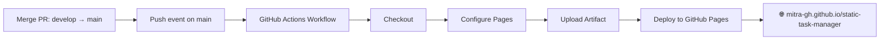

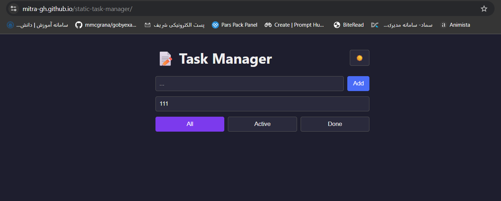

---

## 📚 پاسخ به سوالات نظری

### ۱) پوشه‌ی `.git` چیست، چه چیزی در آن ذخیره می‌شود و با چه دستوری ساخته می‌شود؟

پوشه‌ی `.git` یک پوشه‌ی مخفی در ریشه‌ی پروژه است که **تمام تاریخچه و متادیتای مخزن** در آن نگهداری می‌شود و وجود آن است که یک پوشه‌ی معمولی را به یک مخزن Git تبدیل می‌کند. مهم‌ترین محتویات آن عبارت‌اند از:

- `objects/` — پایگاه‌داده‌ی اشیاء گیت: **کامیت‌ها، درخت‌ها (tree) و بلاب‌ها (blob = محتوای فایل‌ها)** که همگی با هش SHA-1 آدرس‌دهی می‌شوند.
- `refs/` — اشاره‌گرها به کامیت‌ها: شاخه‌های محلی (`refs/heads`)، شاخه‌های ریموت (`refs/remotes`) و تگ‌ها.
- `HEAD` — مشخص می‌کند مخزن در حال حاضر روی کدام شاخه یا کامیت قرار دارد.
- `index` — همان **Staging Area** (ناحیه‌ی صحنه).
- `config` — تنظیمات مخزن، از جمله آدرس remote ها (در همین پروژه، `origin` و `hamgit` در این فایل تعریف شده‌اند).

این پوشه با دستور `git init` ایجاد می‌شود (دستور `git clone` نیز ابتدا آن را ایجاد و سپس داده‌ها را از مخزن راه‌دور دریافت می‌کند). در صورت حذف این پوشه، کل تاریخچه‌ی محلی از بین می‌رود و پروژه دیگر یک مخزن Git نخواهد بود؛ هرچند فایل‌های کاری باقی می‌مانند.

### ۲) «اتمیک» بودن در Atomic Commit / Atomic Pull Request به چه معناست؟

**اتمیک** به معنای «تجزیه‌ناپذیر» است: هر کامیت یا Pull Request باید **دقیقاً یک تغییر منطقی و کامل** را در بر بگیرد — نه کمتر و نه بیشتر.

- **Atomic Commit:** هر کامیت باید یک کار مشخص را انجام دهد و پروژه پس از اعمال آن در وضعیت سالم و قابل اجرا باقی بماند. برای نمونه در همین پروژه، منطق وظایف به سه کامیت مجزا تقسیم شد: «افزودن وظیفه»، «تکمیل وظیفه» و «حذف وظیفه» — به جای یک کامیت حجیم شامل کل منطق برنامه.
- **Atomic Pull Request:** هر PR باید یک قابلیت یا موضوع واحد را پوشش دهد (برای نمونه، PR جداگانه برای جستجو/فیلتر و PR جداگانه برای تم).

**مزایا:** سهولت بازبینی کد (Code Review)، امکان `revert` یا `cherry-pick` کردن یک تغییر مشخص بدون اثر جانبی، تاریخچه‌ی خواناتر، و یافتن سریع‌تر منشأ خطاها (برای نمونه با `git bisect`).

### ۳) تفاوت fetch ،pull ،merge ،rebase و cherry-pick

| دستور             | عملکرد                                                                                                                                                 |
| ----------------- | ------------------------------------------------------------------------------------------------------------------------------------------------------ |
| `git fetch`       | صرفاً تغییرات مخزن راه‌دور را **دانلود** کرده و ارجاع‌های `origin/...` را به‌روزرسانی می‌کند؛ **هیچ تغییری** در شاخه‌ها و فایل‌های محلی ایجاد نمی‌کند. |
| `git pull`        | معادل `fetch` به‌همراه `merge` (یا در صورت تنظیم، `fetch` به‌همراه `rebase`)؛ تغییرات راه‌دور را دانلود **و** وارد شاخه‌ی فعلی می‌کند.                 |
| `git merge`       | دو خط تاریخچه را با یک **کامیت ادغام (merge commit)** به یکدیگر متصل می‌کند؛ تاریخچه‌ی هر دو شاخه حفظ می‌شود.                                          |
| `git rebase`      | کامیت‌های شاخه را برداشته و **بر روی نوک شاخه‌ی دیگر بازنویسی** می‌کند؛ تاریخچه خطی می‌شود، اما هش کامیت‌ها تغییر می‌کند (بازنویسی تاریخچه).           |
| `git cherry-pick` | **یک کامیت مشخص** را از هر نقطه‌ای از تاریخچه برداشته و نسخه‌ای از آن را روی شاخه‌ی فعلی اعمال می‌کند.                                                 |

**Merge — تاریخچه‌ی هر دو شاخه حفظ می‌شود:**

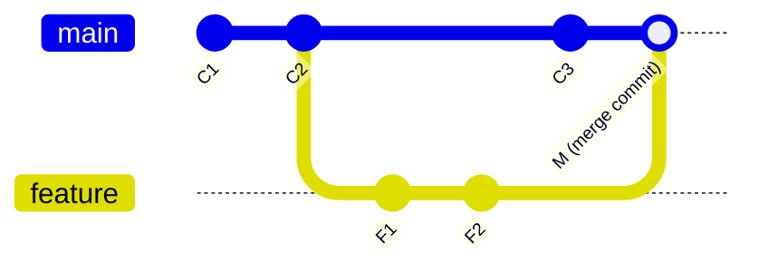

**Rebase — کامیت‌های feature روی نوک main بازنویسی می‌شوند:**

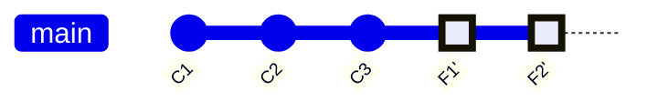

**Cherry-pick — تنها یک کامیت مشخص کپی می‌شود:**

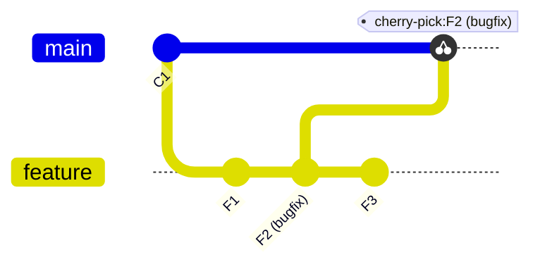

**رابطه‌ی fetch و pull:**

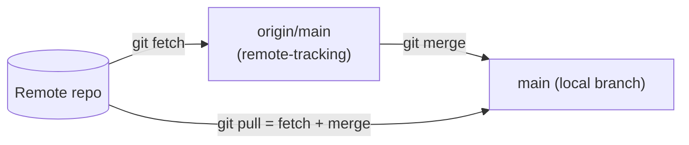

### ۴) تفاوت reset ،revert ،restore ،switch و checkout

| دستور          | عملکرد                                                                                                                                                                                                                                | تاریخچه                              |
| -------------- | ------------------------------------------------------------------------------------------------------------------------------------------------------------------------------------------------------------------------------------- | ------------------------------------ |
| `git reset`    | اشاره‌گر شاخه (و بسته به حالت، ناحیه‌ی stage و working directory) را به یک کامیت قبلی **بازمی‌گرداند**؛ کامیت‌های بعدی از تاریخچه‌ی شاخه حذف می‌شوند. حالت‌ها: `--soft` (فقط HEAD)، `--mixed` (HEAD و stage)، `--hard` (هر سه ناحیه). | **بازنویسی می‌شود** ⚠️               |
| `git revert`   | یک **کامیت جدید** ایجاد می‌کند که اثر یک کامیت قبلی را خنثی می‌کند.                                                                                                                                                                   | حفظ می‌شود ✅ (مناسب شاخه‌های مشترک) |
| `git restore`  | فایل‌ها را بازمی‌گرداند: `git restore file` تغییرات working directory را حذف می‌کند و `git restore --staged file` فایل را از stage خارج می‌کند. این دستور با شاخه‌ها کاری ندارد.                                                      | —                                    |
| `git switch`   | صرفاً برای **جابه‌جایی میان شاخه‌ها** (`git switch develop`) یا ایجاد شاخه‌ی جدید (`git switch -c new`).                                                                                                                              | —                                    |
| `git checkout` | دستور قدیمی و چندمنظوره‌ای که وظایف هر دو دستور `switch` و `restore` را بر عهده داشت؛ به دلیل ابهام در کاربرد، در نسخه‌های جدید Git به دو دستور مجزا تفکیک شد.                                                                        | —                                    |

**Reset در برابر Revert:**

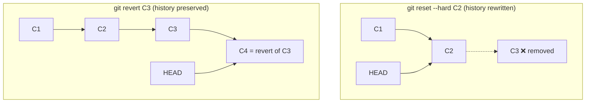

> جمع‌بندی: بر روی شاخه‌های **عمومی و مشترک** باید از `revert` استفاده شود؛ استفاده از `reset` تنها برای تاریخچه‌ی **محلیِ push نشده** بی‌خطر است.

### ۵) ناحیه‌ی Stage (Index) چیست؟ دستور stash چه می‌کند؟

Git دارای سه ناحیه‌ی اصلی است:

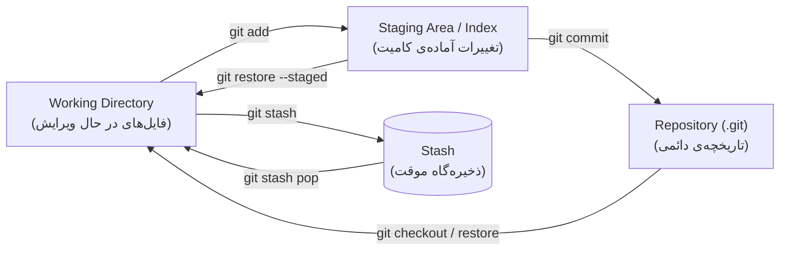

- **Staging Area (Index):** لایه‌ی میانی بین فایل‌های کاری و مخزن. با دستور `git add` تغییرات موردنظر برای کامیت بعدی انتخاب می‌شوند. وجود همین لایه است که امکان ایجاد **کامیت‌های اتمیک** را فراهم می‌کند: می‌توان تنها بخشی از تغییرات را stage و کامیت کرد.
- **`git stash`:** تغییرات کامیت‌نشده (در working directory و stage) را در یک ذخیره‌گاه موقت نگهداری کرده و working directory را به وضعیت پاکیزه بازمی‌گرداند. کاربرد رایج آن زمانی است که در میانه‌ی کار نیاز به تعویض شاخه وجود دارد، بدون آن‌که کامیت ناقصی ایجاد شود. بازگرداندن تغییرات با `git stash pop` (اعمال و حذف از ذخیره‌گاه) یا `git stash apply` (صرفاً اعمال) انجام می‌شود.

### ۶) Snapshot چیست و چه رابطه‌ای با کامیت دارد؟

بر خلاف برخی سیستم‌های کنترل نسخه‌ی قدیمی‌تر که «تفاوت‌ها (diff)» را ذخیره می‌کردند، Git در هر کامیت یک **Snapshot (تصویر لحظه‌ای) از وضعیت کامل پروژه** ذخیره می‌کند.

هر **کامیت** شامل موارد زیر است: اشاره‌گر به یک **tree** (تصویر کامل ساختار پوشه‌ها و فایل‌ها در آن لحظه)، اشاره‌گر به **کامیت والد**، و متادیتا (نویسنده، تاریخ، پیام). فایل‌هایی که تغییر نکرده‌اند مجدداً ذخیره نمی‌شوند — کامیت جدید صرفاً به **همان اشیاء قبلی** ارجاع می‌دهد؛ به همین دلیل ذخیره‌سازی snapshot ها حجم قابل توجهی اشغال نمی‌کند.

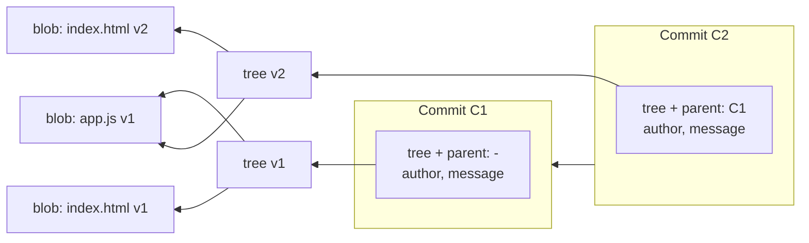

در نمودار بالا، فایل `app.js` میان دو کامیت تغییر نکرده است؛ در نتیجه هر دو tree به **یک blob مشترک** ارجاع می‌دهند (بدون کپی مجدد). بنابراین: **کامیت = snapshot + والد + متادیتا**، و تاریخچه‌ی Git زنجیره‌ای از این snapshot هاست.

### ۷) تفاوت مخزن محلی (Local) و مخزن راه‌دور (Remote)

- **مخزن محلی:** بر روی سیستم کاربر قرار دارد (پوشه‌ی `.git`). تقریباً تمام عملیات (commit، branch، merge، log و غیره) به صورت **آفلاین** روی آن انجام می‌شود و کامل بودن تاریخچه در آن، از ویژگی‌های «توزیع‌شده» بودن Git است.
- **مخزن راه‌دور:** نسخه‌ای از مخزن بر روی یک سرور (مانند GitHub یا Hamgit) که برای **همگام‌سازی و همکاری تیمی** و همچنین **پشتیبان‌گیری** استفاده می‌شود.

ارتباط میان این دو با دستورات `clone`، `fetch`، `pull` و `push` برقرار می‌شود. یک مخزن محلی می‌تواند **چند remote** داشته باشد — مانند همین پروژه که به صورت هم‌زمان به `origin` (GitHub) و `hamgit` (Hamgit) push می‌شود:

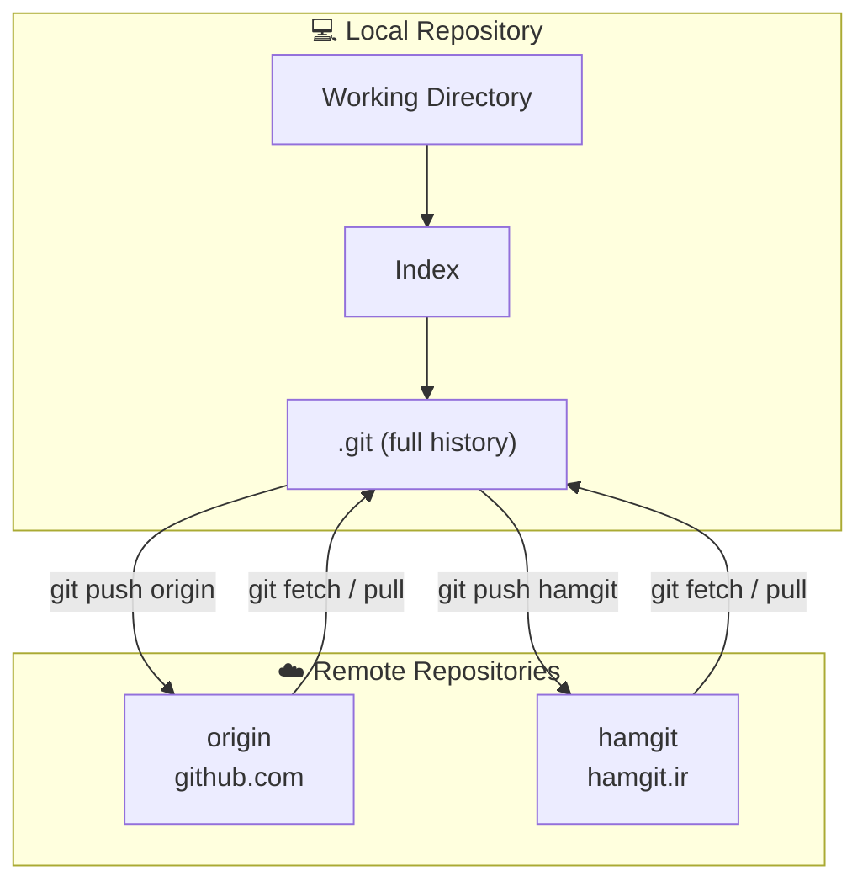

---

> 🤖 توضیحات مربوط به نحوه‌ی استفاده از ابزارهای هوش مصنوعی در این پروژه در فایل [docs/ai.md](docs/ai.md) آمده است.

---

## 📖 منابع

- [Pro Git Book — What is Git?](https://git-scm.com/book/en/v2/Getting-Started-What-is-Git%3F)
- [Learn Git Branching](https://learngitbranching.js.org/)
