# Conversation
- conversationId: 6ed29e9d-5718-44c0-b9cc-d0024a209fc6
- endpoint: anthropic
- title: Dual Remote Git Assignment Setup
- exportAt: 18:52:33 GMT+0330 (Iran Standard Time)

## Options
- presetId: null
- model: claude-fable-5
- resendFiles: true
- maxContextTokens: 828400
- endpoint: anthropic
- endpointType: undefined
- title: Dual Remote Git Assignment Setup

## History
**User**
Hi. I have a university assignment for my software engineering lab. Here is the assignment description (in Persian):

---

دانشجوی گرامی

به اولین درس از آز مهندسی نرم افزار خوش آمدید. برای آشنایی با گیت، می‌توانید از این فیلم استفاده کنید.

همچنین همان طور که گفته شد، لازم است که عملکرد خود را به صورت شفاف بر روی یک ابزار کانبان بورد گزارش کنید. کانبان بورد شما باید به صورت عمومی قابل مشاهده باشد. یکی از ابزارهای کانبان بورد، در گیت هاب موجود است (می‌توانید به این فیلم مراجعه کنید).

توصیه می‌شود که با توجه به شرایط ناپایدار کشور، از گیت هاب استفاده نکنید و از Hamgit به آدرس زیر استفاده کنید :

https://hamgit.ir/

برای استفاده از همگیت، در ابتدا لازم است که یک گروه در آن تعریف کنید و خودتان و هم گروهی خود را به آن اضافه کنید (لازم است که هر دو دارای حساب کاربری در همگیت باشید). سپس با مراجعه به بخش Projects ، یک پروژه با مشخصات زیر بسازید :

گزینه Create Blank Project را انتخاب کنید.
برای پروژه خود یک نام انتخاب کنید .
سپس یک آدرس برای پروژه تعریف کنید (در جریان تعریف آدرس، گروهی را انتخاب کنید که آن را تعریف کرده بودید).
در سطح مشاهده پذیری (Visibility Level) گزینه Public را انتخاب کنید و پروژه را بسازید.
پس از ساخت پروژه و ورود به آن، از زیرمنوی Plan میتوانید Issue Board را مشاهده کنید و برای پروژه خود، کانبان بورد بسازید.
پس از ساخت پروژه، می‌توانید آدرس آن را به عنوان remote در پروژه خود استفاده کرده و آزمایش‌ها را انجام دهید. شایان ذکر است که برای این منظور لازم است بر روی کامپیوتر خود یک SSH Key ساخته باشید و آن را در همگیت (در این لینک) اضافه کرده باشید.
---

My current status:
- I'm working alone on this project.
- The project will be a simple Task Manager app with plain HTML/CSS/JS.
- I already have the repo cloned locally with two remotes: "origin" (GitHub) and "hamgit" (a GitLab-based server my course uses). I need to push everything to BOTH remotes.
- The main branch is already pushed to both, and branch protection (require pull request, block force push, restrict deletions) is enabled on GitHub.
- SSH is set up and working for both remotes.
- I'm on Windows using PowerShell.

Please guide me step by step with short messages. Give me only ONE step at a time — I'll run it, send you the terminal output, and then you give me the next step.


**Claude**
Great, let's get started! Since main is protected on GitHub, we'll work on a feature branch and merge via pull request.

**Step 1: Verify your setup**

Run this in PowerShell from your project folder:

```powershell
git remote -v
git status
```

Send me the output and we'll continue from there.


**User**
PS C:\Users\mi\OneDrive\Desktop\static-task-manager> git remote -v
hamgit  git@hamgit.ir:mitra9595gh/static-task-manager.git (fetch)
hamgit  git@hamgit.ir:mitra9595gh/static-task-manager.git (push)
origin  git@github.com:mitra-gh/static-task-manager.git (fetch)
origin  git@github.com:mitra-gh/static-task-manager.git (push)
PS C:\Users\mi\OneDrive\Desktop\static-task-manager> git status
On branch main
Your branch is up to date with 'origin/main'.

nothing to commit, working tree clean
PS C:\Users\mi\OneDrive\Desktop\static-task-manager>


**Claude**
Setup looks good — both remotes are configured and your working tree is clean.

**Step 2: Create a feature branch**

Since main is protected, we'll do our work on a new branch:

```powershell
git checkout -b feature/task-manager-ui
```

Send me the output.


**User**
Before we continue — I'd like to use a "develop" branch as an integration branch, so the flow would be: feature branches → develop (via PR) → main (via PR). This will also help me satisfy the "at least 3 meaningful branches" requirement.

So should I first create "develop" from main and push it to both remotes, and then create the feature branch from develop? Please adjust the steps accordingly.


**Claude**
Good plan — that's a clean Git Flow-style setup. Yes, exactly: first `develop` from `main`, push it to both remotes, then branch features off `develop`.

**Step 2 (revised): Create the develop branch**

```powershell
git checkout -b develop
```

Send me the output, then we'll push it to both remotes.


**User**
PS C:\Users\mi\OneDrive\Desktop\static-task-manager> git checkout -b develop
Switched to a new branch 'develop'
PS C:\Users\mi\OneDrive\Desktop\static-task-manager>


**Claude**
**Step 3: Push develop to both remotes**

```powershell
git push -u origin develop
git push hamgit develop
```

The `-u` sets origin as the upstream for tracking. Send me the output.


**User**
PS C:\Users\mi\OneDrive\Desktop\static-task-manager> git checkout -b develop
Switched to a new branch 'develop'
PS C:\Users\mi\OneDrive\Desktop\static-task-manager> git push -u origin develop
Total 0 (delta 0), reused 0 (delta 0), pack-reused 0
remote: 
remote: Create a pull request for 'develop' on GitHub by visiting:
remote:      https://github.com/mitra-gh/static-task-manager/pull/new/develop
remote: 
To github.com:mitra-gh/static-task-manager.git
 * [new branch]      develop -> develop
branch 'develop' set up to track 'origin/develop'.
PS C:\Users\mi\OneDrive\Desktop\static-task-manager> git push hamgit develop
Total 0 (delta 0), reused 0 (delta 0), pack-reused 0
remote: 
remote: To create a merge request for develop, visit:
remote:   https://hamgit.ir/mitra9595gh/static-task-manager/-/merge_requests/new?merge_request%5Bsource_branch%5D=develop
remote: 
To hamgit.ir:mitra9595gh/static-task-manager.git
 * [new branch]      develop -> develop
PS C:\Users\mi\OneDrive\Desktop\static-task-manager>


**Claude**
`develop` is now on both remotes. ✅

**Step 4: Create the feature branch from develop**

You're already on `develop`, so:

```powershell
git checkout -b feature/task-manager-ui
```

Send me the output.


**User**
Small change: I'd like the first feature branch to be "feature/project-setup" (for .gitignore + initial HTML/CSS/JS structure), and later create separate feature branches for each functionality (like task management, search/filter, theme). Is that okay?


**Claude**
That's a good approach — small, focused feature branches make for cleaner PRs and a better-looking Kanban board history.

**Step 4 (revised): Create the setup feature branch**

You're on `develop`, so:

```powershell
git checkout -b feature/project-setup
```

Send me the output.


**User**
PS C:\Users\mi\OneDrive\Desktop\static-task-manager> git checkout -b feature/project-setup
Switched to a new branch 'feature/project-setup'
PS C:\Users\mi\OneDrive\Desktop\static-task-manager>


**Claude**
**Step 5: Create a .gitignore**

Run this to create it:

```powershell
@"
# Editor/OS files
.vscode/
.idea/
Thumbs.db
Desktop.ini
*.log
"@ | Out-File -Encoding utf8 .gitignore
```

Then verify:

```powershell
git status
```

Send me the output.


**User**
i write gitignore:
# Build output
dist/
build/

# Environment files
.env

# Editor/OS files
.vscode/
.idea/
.DS_Store
Thumbs.db
Desktop.ini
*.log
from my pervious project:
PS C:\Users\mi\OneDrive\Desktop\static-task-manager> git status
On branch feature/project-setup
Untracked files:
  (use "git add <file>..." to include in what will be committed)
        .gitignore

nothing added to commit but untracked files present (use "git add" to track)
PS C:\Users\mi\OneDrive\Desktop\static-task-manager>


**Claude**
Your .gitignore is even better — good call. 👍

**Step 6: Commit the .gitignore**

```powershell
git add .gitignore
git commit -m "chore: add .gitignore"
```

Send me the output.


**User**
PS C:\Users\mi\OneDrive\Desktop\static-task-manager> git commit -m  "chore: add .gitignore"
[feature/project-setup 6b2b305] chore: add .gitignore
 1 file changed, 17 insertions(+)
 create mode 100644 .gitignore
PS C:\Users\mi\OneDrive\Desktop\static-task-manager>


**Claude**
Committed. ✅

**Step 7: Create the initial file structure**

Create three files: `index.html`, `css/style.css`, `js/app.js`.

```powershell
New-Item -ItemType Directory css, js
New-Item index.html, css\style.css, js\app.js
```

Then put a minimal skeleton in `index.html`:

```html
<!DOCTYPE html>
<html lang="en">
<head>
  <meta charset="UTF-8">
  <meta name="viewport" content="width=device-width, initial-scale=1.0">
  <title>Task Manager</title>
  <link rel="stylesheet" href="css/style.css">
</head>
<body>
  <h1>Task Manager</h1>
  <script src="js/app.js"></script>
</body>
</html>
```

(CSS/JS files can stay empty for now — real code comes in later feature branches.)

Run `git status` when done and send me the output.


**User**
PS C:\Users\mi\OneDrive\Desktop\static-task-manager> git push -u origin feature/project-setup
Enumerating objects: 4, done.
Counting objects: 100% (4/4), done.
Delta compression using up to 20 threads
Compressing objects: 100% (3/3), done.
Writing objects: 100% (3/3), 413 bytes | 413.00 KiB/s, done.
Total 3 (delta 0), reused 0 (delta 0), pack-reused 0
remote: 
remote: Create a pull request for 'feature/project-setup' on GitHub by visiting:
remote:      https://github.com/mitra-gh/static-task-manager/pull/new/feature/project-setup
remote: 
To github.com:mitra-gh/static-task-manager.git
 * [new branch]      feature/project-setup -> feature/project-setup
branch 'feature/project-setup' set up to track 'origin/feature/project-setup'.
PS C:\Users\mi\OneDrive\Desktop\static-task-manager> git push hamgit feature/project-setup
Enumerating objects: 4, done.
Counting objects: 100% (4/4), done.
Delta compression using up to 20 threads
Compressing objects: 100% (3/3), done.
Writing objects: 100% (3/3), 413 bytes | 413.00 KiB/s, done.
Total 3 (delta 0), reused 0 (delta 0), pack-reused 0
remote: 
remote: To create a merge request for feature/project-setup, visit:
remote:   https://hamgit.ir/mitra9595gh/static-task-manager/-/merge_requests/new?merge_request%5Bsource_branch%5D=feature%2Fproject-setup
remote: 
To hamgit.ir:mitra9595gh/static-task-manager.git
 * [new branch]      feature/project-setup -> feature/project-setup
PS C:\Users\mi\OneDrive\Desktop\static-task-manager> New-Item -ItemType Directory css, js


    Directory: C:\Users\mi\OneDrive\Desktop\static-task-manager


Mode                 LastWriteTime         Length Name
----                 -------------         ------ ----
d-----         8/13/2026   3:32 PM                css
d-----         8/13/2026   3:32 PM                js


PS C:\Users\mi\OneDrive\Desktop\static-task-manager> New-Item index.html, css\style.css, js\app.js


    Directory: C:\Users\mi\OneDrive\Desktop\static-task-manager


Mode                 LastWriteTime         Length Name
----                 -------------         ------ ----
-a----         8/13/2026   3:32 PM              0 index.html


    Directory: C:\Users\mi\OneDrive\Desktop\static-task-manager\css


Mode                 LastWriteTime         Length Name
----                 -------------         ------ ----
-a----         8/13/2026   3:32 PM              0 style.css


    Directory: C:\Users\mi\OneDrive\Desktop\static-task-manager\js


Mode                 LastWriteTime         Length Name
----                 -------------         ------ ----
-a----         8/13/2026   3:32 PM              0 app.js


PS C:\Users\mi\OneDrive\Desktop\static-task-manager> git status
On branch feature/project-setup
Your branch is up to date with 'origin/feature/project-setup'.

Untracked files:
  (use "git add <file>..." to include in what will be committed)
        css/
        index.html
        js/

nothing added to commit but untracked files present (use "git add" to track)
PS C:\Users\mi\OneDrive\Desktop\static-task-manager>


**Claude**
Nice — I see you also pushed the feature branch to both remotes already. 👍

One thing: `index.html` is 0 bytes, so make sure you paste the HTML skeleton into it (open it in your editor and save).

**Step 8: Commit the structure**

Once `index.html` has the skeleton content:

```powershell
git add .
git commit -m "feat: add initial project structure (HTML/CSS/JS)"
```

Send me the output.


**User**
PS C:\Users\mi\OneDrive\Desktop\static-task-manager> git add .
PS C:\Users\mi\OneDrive\Desktop\static-task-manager> git commit -m "feat: add initial project structure (HTML/CSS/JS)"
[feature/project-setup 1cfac68] feat: add initial project structure (HTML/CSS/JS)
 3 files changed, 13 insertions(+)
 create mode 100644 css/style.css
 create mode 100644 index.html
 create mode 100644 js/app.js
PS C:\Users\mi\OneDrive\Desktop\static-task-manager>


**Claude**
Committed — 13 insertions means the HTML skeleton made it in. ✅

**Step 9: Push to both remotes**

```powershell
git push origin feature/project-setup
git push hamgit feature/project-setup
```

Send me the output. After this, we'll open the PR on GitHub to merge into `develop`.


**User**
PS C:\Users\mi\OneDrive\Desktop\static-task-manager> git push origin feature/project-setup
Enumerating objects: 7, done.
Counting objects: 100% (7/7), done.
Delta compression using up to 20 threads
Compressing objects: 100% (3/3), done.
Writing objects: 100% (6/6), 714 bytes | 714.00 KiB/s, done.
Total 6 (delta 0), reused 0 (delta 0), pack-reused 0
To github.com:mitra-gh/static-task-manager.git
   6b2b305..1cfac68  feature/project-setup -> feature/project-setup
PS C:\Users\mi\OneDrive\Desktop\static-task-manager> git push hamgit feature/project-setup
Enumerating objects: 7, done.
Counting objects: 100% (7/7), done.
Delta compression using up to 20 threads
Compressing objects: 100% (3/3), done.
Writing objects: 100% (6/6), 714 bytes | 714.00 KiB/s, done.
Total 6 (delta 0), reused 0 (delta 0), pack-reused 0
remote: 
remote: To create a merge request for feature/project-setup, visit:
remote:   https://hamgit.ir/mitra9595gh/static-task-manager/-/merge_requests/new?merge_request%5Bsource_branch%5D=feature%2Fproject-setup
remote:
To hamgit.ir:mitra9595gh/static-task-manager.git
   6b2b305..1cfac68  feature/project-setup -> feature/project-setup
PS C:\Users\mi\OneDrive\Desktop\static-task-manager>


**Claude**
Both remotes updated. ✅

**Step 10: Open the pull request on GitHub**

1. Go to: https://github.com/mitra-gh/static-task-manager/pull/new/feature/project-setup
2. **Important:** change the **base** branch from `main` to `develop`
3. Title: `feat: project setup` (or similar)
4. Create the pull request, then **merge** it.

Tell me when it's merged (and let me know which merge option you used — "Merge commit" is fine).


**User**
Pull request successfully merged and closed


**Claude**
PR merged. ✅

**Step 11: Sync develop locally and on Hamgit**

The merge happened on GitHub, so pull it down and mirror it to Hamgit:

```powershell
git checkout develop
git pull origin develop
git push hamgit develop
```

Send me the output.


**User**
PS C:\Users\mi\OneDrive\Desktop\static-task-manager> git checkout develop
Switched to branch 'develop'
Your branch is up to date with 'origin/develop'.
PS C:\Users\mi\OneDrive\Desktop\static-task-manager> git pull origin develop
remote: Enumerating objects: 1, done.
remote: Counting objects: 100% (1/1), done.
remote: Total 1 (delta 0), reused 0 (delta 0), pack-reused 0 (from 0)
Unpacking objects: 100% (1/1), 903 bytes | 451.00 KiB/s, done.
From github.com:mitra-gh/static-task-manager
 * branch            develop    -> FETCH_HEAD
   2e9b308..88b0061  develop    -> origin/develop
Updating 2e9b308..88b0061
Fast-forward
 .gitignore    | 17 +++++++++++++++++
 css/style.css |  0
 index.html    | 13 +++++++++++++
 js/app.js     |  0
 4 files changed, 30 insertions(+)
 create mode 100644 .gitignore
 create mode 100644 css/style.css
 create mode 100644 index.html
 create mode 100644 js/app.js
PS C:\Users\mi\OneDrive\Desktop\static-task-manager> git push hamgit develop
Enumerating objects: 11, done.
Counting objects: 100% (11/11), done.
Delta compression using up to 20 threads
Compressing objects: 100% (7/7), done.
Writing objects: 100% (10/10), 1.87 KiB | 1.87 MiB/s, done.
Total 10 (delta 1), reused 0 (delta 0), pack-reused 0
remote: 
remote: To create a merge request for develop, visit:
remote:   https://hamgit.ir/mitra9595gh/static-task-manager/-/merge_requests/new?merge_request%5Bsource_branch%5D=develop
remote:
To hamgit.ir:mitra9595gh/static-task-manager.git
   2e9b308..88b0061  develop -> develop
PS C:\Users\mi\OneDrive\Desktop\static-task-manager>


**Claude**
`develop` is now in sync everywhere. ✅

**Step 12: Clean up the merged feature branch**

Delete it locally and on both remotes to keep things tidy:

```powershell
git branch -d feature/project-setup
git push origin --delete feature/project-setup
git push hamgit --delete feature/project-setup
```

Send me the output. After this, we'll start the next feature branch: `feature/task-management`.


**User**
I'd prefer NOT to delete merged branches — my instructor needs to see at least 3 meaningful branches in the repo for grading (and in my demo video). Let's keep them and move on to the next feature branch.


**Claude**
Fair enough — keeping them makes your branch history visible for grading. Skipping cleanup. 👍

**Step 12 (revised): Create the next feature branch**

You're on `develop`, so:

```powershell
git checkout -b feature/task-management
```

Send me the output. This branch will hold the core task logic (add/complete/delete tasks).


**User**
PS C:\Users\mi\OneDrive\Desktop\static-task-manager> git checkout -b feature/task-management
Switched to a new branch 'feature/task-management'
PS C:\Users\mi\OneDrive\Desktop\static-task-manager>


**Claude**
**Step 13: Add the task manager HTML**

Replace the `<body>` content of `index.html` with:

```html
<body>
  <main class="container">
    <h1>Task Manager</h1>
    <form id="task-form">
      <input type="text" id="task-input" placeholder="Add a new task..." required>
      <button type="submit">Add</button>
    </form>
    <ul id="task-list"></ul>
  </main>
  <script src="js/app.js"></script>
</body>
```

Then commit:

```powershell
git add index.html
git commit -m "feat: add task form and list markup"
```

Send me the output.


**User**
PS C:\Users\mi\OneDrive\Desktop\static-task-manager> git add index.html
PS C:\Users\mi\OneDrive\Desktop\static-task-manager> git commit -m "feat: add task form and list markup"
[feature/task-management d67af66] feat: add task form and list markup
 1 file changed, 13 insertions(+), 1 deletion(-)
PS C:\Users\mi\OneDrive\Desktop\static-task-manager> git push -u origin feature/task-management
Enumerating objects: 5, done.
Counting objects: 100% (5/5), done.
Delta compression using up to 20 threads
Compressing objects: 100% (3/3), done.
Writing objects: 100% (3/3), 598 bytes | 598.00 KiB/s, done.
Total 3 (delta 1), reused 0 (delta 0), pack-reused 0
remote: Resolving deltas: 100% (1/1), completed with 1 local object.
remote: 
remote: Create a pull request for 'feature/task-management' on GitHub by visiting:
remote:      https://github.com/mitra-gh/static-task-manager/pull/new/feature/task-management
remote:
To github.com:mitra-gh/static-task-manager.git
 * [new branch]      feature/task-management -> feature/task-management
branch 'feature/task-management' set up to track 'origin/feature/task-management'.
PS C:\Users\mi\OneDrive\Desktop\static-task-manager> git push hamgit feature/task-management
Enumerating objects: 5, done.
Counting objects: 100% (5/5), done.
Delta compression using up to 20 threads
Compressing objects: 100% (3/3), done.
Writing objects: 100% (3/3), 598 bytes | 598.00 KiB/s, done.
Total 3 (delta 1), reused 0 (delta 0), pack-reused 0
remote: 
remote: To create a merge request for feature/task-management, visit:
remote:   https://hamgit.ir/mitra9595gh/static-task-manager/-/merge_requests/new?merge_request%5Bsource_branch%5D=feature%2Ftask-management
remote:
To hamgit.ir:mitra9595gh/static-task-manager.git
 * [new branch]      feature/task-management -> feature/task-management
PS C:\Users\mi\OneDrive\Desktop\static-task-manager>


**Claude**
Committed and pushed to both remotes — you're getting ahead of me. 😄 ✅

**Step 14: Add the task logic in `js/app.js`**

Paste this in:

```javascript
const form = document.getElementById('task-form');
const input = document.getElementById('task-input');
const list = document.getElementById('task-list');

let tasks = JSON.parse(localStorage.getItem('tasks')) || [];

function save() {
  localStorage.setItem('tasks', JSON.stringify(tasks));
}

function render() {
  list.innerHTML = '';
  tasks.forEach((task, i) => {
    const li = document.createElement('li');
    li.className = task.done ? 'done' : '';

    const span = document.createElement('span');
    span.textContent = task.text;
    span.addEventListener('click', () => {
      tasks[i].done = !tasks[i].done;
      save();
      render();
    });

    const btn = document.createElement('button');
    btn.textContent = '✕';
    btn.className = 'delete-btn';
    btn.addEventListener('click', () => {
      tasks.splice(i, 1);
      save();
      render();
    });

    li.append(span, btn);
    list.appendChild(li);
  });
}

form.addEventListener('submit', (e) => {
  e.preventDefault();
  tasks.push({ text: input.value.trim(), done: false });
  input.value = '';
  save();
  render();
});

render();
```

Then commit:

```powershell
git add js/app.js
git commit -m "feat: add task add/complete/delete logic with localStorage"
```

Send me the output.


**User**
I want more granular commits (I need 20+ meaningful commits). Let's split this into 3 commits:
1. add task creation + render + localStorage save
2. add toggle complete on click
3. add delete button

I'll do commit 1 now with only the form submit, save, and a simple render (without toggle/delete).


**Claude**
Good idea — granular commits show clearer history. Here's the plan:

**Step 14a (commit 1): Task creation + render + save**

In `js/app.js`, include only:
- The three `const` declarations (form, input, list)
- `tasks` array + `save()`
- A simple `render()` that just creates `li` elements with the task text (no click handlers, no delete button)
- The form `submit` listener
- The final `render()` call

Then:

```powershell
git add js/app.js
git commit -m "feat: add task creation with localStorage persistence"
```

Send me the output, then we'll do commit 2 (toggle complete).


**User**
PS C:\Users\mi\OneDrive\Desktop\static-task-manager> git add js/app.js
PS C:\Users\mi\OneDrive\Desktop\static-task-manager> git commit -m "feat: add task creation with localStorage persistence"
[feature/task-management cbb8f15] feat: add task creation with localStorage persistence
 1 file changed, 28 insertions(+)
PS C:\Users\mi\OneDrive\Desktop\static-task-manager> git add js/app.js
PS C:\Users\mi\OneDrive\Desktop\static-task-manager> git commit -m "feat: toggle task completion on click"
[feature/task-management 14b210c] feat: toggle task completion on click
 1 file changed, 12 insertions(+), 2 deletions(-)
PS C:\Users\mi\OneDrive\Desktop\static-task-manager> git add js/app.js
PS C:\Users\mi\OneDrive\Desktop\static-task-manager> git commit -m "feat: add task deletion"
[feature/task-management 3662b8d] feat: add task deletion
 1 file changed, 10 insertions(+), 1 deletion(-)
PS C:\Users\mi\OneDrive\Desktop\static-task-manager> git push
Enumerating objects: 15, done.
Counting objects: 100% (15/15), done.
Delta compression using up to 20 threads
Compressing objects: 100% (9/9), done.
Writing objects: 100% (12/12), 1.39 KiB | 1.39 MiB/s, done.
Total 12 (delta 5), reused 0 (delta 0), pack-reused 0
remote: Resolving deltas: 100% (5/5), completed with 1 local object.
To github.com:mitra-gh/static-task-manager.git
   d67af66..3662b8d  feature/task-management -> feature/task-management
PS C:\Users\mi\OneDrive\Desktop\static-task-manager> git push hamgit feature/task-management
Enumerating objects: 15, done.
Counting objects: 100% (15/15), done.
Delta compression using up to 20 threads
Compressing objects: 100% (9/9), done.
Writing objects: 100% (12/12), 1.39 KiB | 1.39 MiB/s, done.
Total 12 (delta 5), reused 0 (delta 0), pack-reused 0
remote: 
remote: To create a merge request for feature/task-management, visit:
remote:   https://hamgit.ir/mitra9595gh/static-task-manager/-/merge_requests/new?merge_request%5Bsource_branch%5D=feature%2Ftask-management
remote:
To hamgit.ir:mitra9595gh/static-task-manager.git
   d67af66..3662b8d  feature/task-management -> feature/task-management
PS C:\Users\mi\OneDrive\Desktop\static-task-manager> 


const form = document.getElementById("task-form");
const input = document.getElementById("task-input");
const list = document.getElementById("task-list");

let tasks = JSON.parse(localStorage.getItem("tasks")) || [];

function save() {
  localStorage.setItem("tasks", JSON.stringify(tasks));
}

function render() {
  list.innerHTML = "";
  tasks.forEach((task, i) => {
    const li = document.createElement("li");
    li.className = task.done ? "done" : "";

    const span = document.createElement("span");
    span.textContent = task.text;
    span.addEventListener("click", () => {
      tasks[i].done = !tasks[i].done;
      save();
      render();
    });

    const btn = document.createElement("button");
    btn.textContent = "✕";
    btn.className = "delete-btn";
    btn.addEventListener("click", () => {
      tasks.splice(i, 1);
      save();
      render();
    });

    li.append(span, btn);
    list.appendChild(li);
  });
}

form.addEventListener("submit", (e) => {
  e.preventDefault();
  tasks.push({ text: input.value.trim(), done: false });
  input.value = "";
  save();
  render();
});

render();


**Claude**
Excellent — all 3 commits done and pushed to both remotes. The code looks complete and correct. ✅

**Step 15: Add minimal functional CSS**

Since `done` and `delete-btn` classes are used, add this to `css/style.css` (full theming comes later in its own branch):

```css
li.done span {
  text-decoration: line-through;
  opacity: 0.6;
}

.delete-btn {
  cursor: pointer;
}
```

Then:

```powershell
git add css/style.css
git commit -m "style: add completed-task and delete button styles"
git push
git push hamgit feature/task-management
```

Send me the output. After this: PR into `develop`.


**User**
PS C:\Users\mi\OneDrive\Desktop\static-task-manager> git add css/style.css
PS C:\Users\mi\OneDrive\Desktop\static-task-manager> git commit -m "style: add completed-task and delete button styles"
[feature/task-management 77c094f] style: add completed-task and delete button styles
 1 file changed, 8 insertions(+)
PS C:\Users\mi\OneDrive\Desktop\static-task-manager> git push
Enumerating objects: 7, done.
Counting objects: 100% (7/7), done.
Delta compression using up to 20 threads
Compressing objects: 100% (3/3), done.
Writing objects: 100% (4/4), 416 bytes | 416.00 KiB/s, done.
Total 4 (delta 1), reused 0 (delta 0), pack-reused 0
remote: Resolving deltas: 100% (1/1), completed with 1 local object.
To github.com:mitra-gh/static-task-manager.git
   3662b8d..77c094f  feature/task-management -> feature/task-management
PS C:\Users\mi\OneDrive\Desktop\static-task-manager> git push hamgit feature/task-management
Enumerating objects: 7, done.
Counting objects: 100% (7/7), done.
Delta compression using up to 20 threads
Compressing objects: 100% (3/3), done.
Writing objects: 100% (4/4), 416 bytes | 416.00 KiB/s, done.
Total 4 (delta 1), reused 0 (delta 0), pack-reused 0
remote: 
remote: To create a merge request for feature/task-management, visit:
remote:   https://hamgit.ir/mitra9595gh/static-task-manager/-/merge_requests/new?merge_request%5Bsource_branch%5D=feature%2Ftask-management
remote:
To hamgit.ir:mitra9595gh/static-task-manager.git
   3662b8d..77c094f  feature/task-management -> feature/task-management
PS C:\Users\mi\OneDrive\Desktop\static-task-manager>


**Claude**
Pushed to both remotes. ✅ Before the PR, quickly open `index.html` in your browser and verify add/complete/delete all work.

**Step 16: Open the PR on GitHub**

1. Go to: https://github.com/mitra-gh/static-task-manager/pull/new/feature/task-management
2. Set **base** to `develop` (not `main`!)
3. Title: `feat: task management (add/complete/delete)`
4. Create and merge the PR.

Tell me when it's merged.


**User**
Pull request successfully merged and closed


**Claude**
Merged. ✅

**Step 17: Sync develop again**

```powershell
git checkout develop
git pull origin develop
git push hamgit develop
```

Send me the output. Then we'll start `feature/search-filter`.


**User**
PS C:\Users\mi\OneDrive\Desktop\static-task-manager> git checkout develop
Switched to branch 'develop'
Your branch is up to date with 'origin/develop'.
PS C:\Users\mi\OneDrive\Desktop\static-task-manager> git pull origin develop
remote: Enumerating objects: 1, done.
remote: Counting objects: 100% (1/1), done.
remote: Total 1 (delta 0), reused 0 (delta 0), pack-reused 0 (from 0)
Unpacking objects: 100% (1/1), 926 bytes | 308.00 KiB/s, done.
From github.com:mitra-gh/static-task-manager
 * branch            develop    -> FETCH_HEAD
   88b0061..d58d907  develop    -> origin/develop
Updating 88b0061..d58d907
Fast-forward
 css/style.css |  8 ++++++++
 index.html    | 14 +++++++++++++-
 js/app.js     | 47 +++++++++++++++++++++++++++++++++++++++++++++++
 3 files changed, 68 insertions(+), 1 deletion(-)
PS C:\Users\mi\OneDrive\Desktop\static-task-manager> git push hamgit develop
Enumerating objects: 1, done.
Counting objects: 100% (1/1), done.
Writing objects: 100% (1/1), 946 bytes | 946.00 KiB/s, done.
Total 1 (delta 0), reused 0 (delta 0), pack-reused 0
remote: 
remote: To create a merge request for develop, visit:
remote:   https://hamgit.ir/mitra9595gh/static-task-manager/-/merge_requests/new?merge_request%5Bsource_branch%5D=develop
remote: 
To hamgit.ir:mitra9595gh/static-task-manager.git
   88b0061..d58d907  develop -> develop
PS C:\Users\mi\OneDrive\Desktop\static-task-manager>


**Claude**
In sync. ✅

**Step 18: Create the search/filter branch**

```powershell
git checkout -b feature/search-filter
```

Send me the output. Plan for this branch (granular commits again):
1. Search input markup
2. Search logic in JS
3. Filter buttons (All / Active / Done)


**User**
git branch
  develop
  feature/project-setup
* feature/search-filter
  feature/task-management
  main
PS C:\Users\mi\OneDrive\Desktop\static-task-manager>


**Claude**
Branch created — and I can see all your branches preserved for grading. 👍

**Step 19 (commit 1): Add search markup**

In `index.html`, add this right after the `</form>` closing tag:

```html
<input type="text" id="search-input" placeholder="Search tasks...">
```

Then:

```powershell
git add index.html
git commit -m "feat: add search input markup"
```

Send me the output.


**User**
git add index.html
PS C:\Users\mi\OneDrive\Desktop\static-task-manager> git commit -m "feat: add search input markup"
[feature/search-filter 770a084] feat: add search input markup
 1 file changed, 1 insertion(+)
PS C:\Users\mi\OneDrive\Desktop\static-task-manager>


**Claude**
**Step 20 (commit 2): Add search logic**

In `js/app.js`:

1. Add with the other `const` declarations:

```javascript
const searchInput = document.getElementById('search-input');
```

2. In `render()`, change the loop to skip non-matching tasks. At the top of the `forEach` callback, add:

```javascript
const query = searchInput.value.trim().toLowerCase();
if (query && !task.text.toLowerCase().includes(query)) return;
```

3. At the bottom of the file, add:

```javascript
searchInput.addEventListener('input', render);
```

Test it in the browser, then:

```powershell
git add js/app.js
git commit -m "feat: filter tasks by search query"
```

Send me the output.


**User**
is this true?
const form = document.getElementById("task-form");
const input = document.getElementById("task-input");
const list = document.getElementById("task-list");
const searchInput = document.getElementById("search-input");

let tasks = JSON.parse(localStorage.getItem("tasks")) || [];

searchInput.addEventListener("input", render);

function save() {
  localStorage.setItem("tasks", JSON.stringify(tasks));
}

function render() {
  list.innerHTML = "";
  tasks.forEach((task, i) => {
    const query = searchInput.value.trim().toLowerCase();
    if (query && !task.text.toLowerCase().includes(query)) {
      return;
    }
    const li = document.createElement("li");
    li.className = task.done ? "done" : "";

    const span = document.createElement("span");
    span.textContent = task.text;
    span.addEventListener("click", () => {
      tasks[i].done = !tasks[i].done;
      save();
      render();
    });

    const btn = document.createElement("button");
    btn.textContent = "✕";
    btn.className = "delete-btn";
    btn.addEventListener("click", () => {
      tasks.splice(i, 1);
      save();
      render();
    });

    li.append(span, btn);
    list.appendChild(li);
  });
}

form.addEventListener("submit", (e) => {
  e.preventDefault();
  tasks.push({ text: input.value.trim(), done: false });
  input.value = "";
  save();
  render();
});

render();


**Claude**
Yes, that's correct and will work! ✅ (Placing `searchInput.addEventListener` before `render`'s definition is fine — function declarations are hoisted.)

One tiny improvement: the `query` doesn't change between iterations, so compute it once **before** the `forEach` instead of inside it:

```javascript
function render() {
  list.innerHTML = "";
  const query = searchInput.value.trim().toLowerCase();
  tasks.forEach((task, i) => {
    if (query && !task.text.toLowerCase().includes(query)) {
      return;
    }
    // ...rest unchanged
```

Test in the browser, then commit:

```powershell
git add js/app.js
git commit -m "feat: filter tasks by search query"
```

Send me the output.


**User**
PS C:\Users\mi\OneDrive\Desktop\static-task-manager> git add js/app.js
PS C:\Users\mi\OneDrive\Desktop\static-task-manager> git commit -m "feat: filter tasks by search query"
[feature/search-filter d6dee04] feat: filter tasks by search query
 1 file changed, 7 insertions(+)
PS C:\Users\mi\OneDrive\Desktop\static-task-manager>


**Claude**
**Step 21 (commit 3): Add filter buttons**

1. In `index.html`, add after the search input:

```html
<div id="filter-buttons">
  <button data-filter="all" class="active">All</button>
  <button data-filter="active">Active</button>
  <button data-filter="done">Done</button>
</div>
```

2. In `js/app.js`, add near the top:

```javascript
let currentFilter = 'all';
```

3. In `render()`, add this check inside the `forEach` (next to the query check):

```javascript
if (currentFilter === 'active' && task.done) return;
if (currentFilter === 'done' && !task.done) return;
```

4. At the bottom of the file, add:

```javascript
document.querySelectorAll('#filter-buttons button').forEach((btn) => {
  btn.addEventListener('click', () => {
    currentFilter = btn.dataset.filter;
    document.querySelectorAll('#filter-buttons button')
      .forEach((b) => b.classList.remove('active'));
    btn.classList.add('active');
    render();
  });
});
```

Test in the browser, then:

```powershell
git add index.html js/app.js
git commit -m "feat: add All/Active/Done filter buttons"
```

Send me the output.


**User**
git add index.html
PS C:\Users\mi\OneDrive\Desktop\static-task-manager> git commit -m "feat: add filter buttons markup"
[feature/search-filter 316d4e0] feat: add filter buttons markup
 1 file changed, 5 insertions(+)
PS C:\Users\mi\OneDrive\Desktop\static-task-manager> git add js/app.js
PS C:\Users\mi\OneDrive\Desktop\static-task-manager> git commit -m "feat: implement All/Active/Done filtering logic"
[feature/search-filter 4ab95e4] feat: implement All/Active/Done filtering logic
 1 file changed, 16 insertions(+)
PS C:\Users\mi\OneDrive\Desktop\static-task-manager> git push -u origin feature/search-filter
Enumerating objects: 18, done.
Counting objects: 100% (18/18), done.
Delta compression using up to 20 threads
Compressing objects: 100% (12/12), done.
Writing objects: 100% (14/14), 1.62 KiB | 1.62 MiB/s, done.
Total 14 (delta 8), reused 0 (delta 0), pack-reused 0
remote: Resolving deltas: 100% (8/8), completed with 3 local objects.
remote: 
remote: Create a pull request for 'feature/search-filter' on GitHub by visiting:
remote:      https://github.com/mitra-gh/static-task-manager/pull/new/feature/search-filter
remote:
To github.com:mitra-gh/static-task-manager.git
 * [new branch]      feature/search-filter -> feature/search-filter
branch 'feature/search-filter' set up to track 'origin/feature/search-filter'.
PS C:\Users\mi\OneDrive\Desktop\static-task-manager> git push hamgit feature/search-filter


**Claude**
Nice — you even split it into two commits (markup + logic), which is great for your commit count. 👍

Your last command's output got cut off — I'll assume the Hamgit push succeeded (let me know if it didn't).

**Step 22: Open the PR on GitHub**

1. Go to: https://github.com/mitra-gh/static-task-manager/pull/new/feature/search-filter
2. Set **base** to `develop`
3. Title: `feat: search and filter tasks`
4. Create and merge.

Tell me when it's merged.


**User**
Pull request successfully merged and closed


**Claude**
Merged. ✅

**Step 23: Sync develop (same routine)**

```powershell
git checkout develop
git pull origin develop
git push hamgit develop
```

Send me the output. Then we'll start the last feature branch: `feature/theme`.


**User**
PS C:\Users\mi\OneDrive\Desktop\static-task-manager> git pull origin develop
remote: Enumerating objects: 1, done.
remote: Counting objects: 100% (1/1), done.
remote: Total 1 (delta 0), reused 0 (delta 0), pack-reused 0 (from 0)
Unpacking objects: 100% (1/1), 912 bytes | 456.00 KiB/s, done.
From github.com:mitra-gh/static-task-manager
 * branch            develop    -> FETCH_HEAD
   d58d907..293af02  develop    -> origin/develop
Updating d58d907..293af02
Fast-forward
 index.html |  6 ++++++
 js/app.js  | 23 +++++++++++++++++++++++
 2 files changed, 29 insertions(+)
PS C:\Users\mi\OneDrive\Desktop\static-task-manager> git push hamgit develop
Enumerating objects: 19, done.
Counting objects: 100% (19/19), done.
Delta compression using up to 20 threads
Compressing objects: 100% (13/13), done.
Writing objects: 100% (15/15), 2.50 KiB | 2.50 MiB/s, done.
Total 15 (delta 8), reused 0 (delta 0), pack-reused 0
remote: 
remote: To create a merge request for develop, visit:
remote:   https://hamgit.ir/mitra9595gh/static-task-manager/-/merge_requests/new?merge_request%5Bsource_branch%5D=develop
remote:
To hamgit.ir:mitra9595gh/static-task-manager.git
   d58d907..293af02  develop -> develop
PS C:\Users\mi\OneDrive\Desktop\static-task-manager>


**Claude**
In sync. ✅

**Step 24: Create the theme branch**

```powershell
git checkout -b feature/theme
```

Plan (granular commits):
1. Base layout/styling (container, form, list)
2. Dark mode toggle button + CSS variables
3. Persist theme choice in localStorage

Send me the output.


**User**
PS C:\Users\mi\OneDrive\Desktop\static-task-manager> git checkout -b feature/theme
Switched to a new branch 'feature/theme'
PS C:\Users\mi\OneDrive\Desktop\static-task-manager> git push -u origin feature/theme
Total 0 (delta 0), reused 0 (delta 0), pack-reused 0
remote: 
remote: Create a pull request for 'feature/theme' on GitHub by visiting:
remote:      https://github.com/mitra-gh/static-task-manager/pull/new/feature/theme
remote: 
To github.com:mitra-gh/static-task-manager.git
 * [new branch]      feature/theme -> feature/theme
branch 'feature/theme' set up to track 'origin/feature/theme'.
PS C:\Users\mi\OneDrive\Desktop\static-task-manager> git push hamgit feature/theme
Total 0 (delta 0), reused 0 (delta 0), pack-reused 0
remote:
remote: To create a merge request for feature/theme, visit:
remote:   https://hamgit.ir/mitra9595gh/static-task-manager/-/merge_requests/new?merge_request%5Bsource_branch%5D=feature%2Ftheme
remote:
To hamgit.ir:mitra9595gh/static-task-manager.git
 * [new branch]      feature/theme -> feature/theme
PS C:\Users\mi\OneDrive\Desktop\static-task-manager>


**Claude**
Branch created and pushed to both. ✅

**Step 25 (commit 1): Base layout styling**

Add this at the **top** of `css/style.css` (above the existing rules):

```css
* {
  box-sizing: border-box;
  margin: 0;
  padding: 0;
}

body {
  font-family: system-ui, sans-serif;
  background: #f4f5f7;
  color: #222;
  min-height: 100vh;
  padding: 2rem 1rem;
}

.container {
  max-width: 480px;
  margin: 0 auto;
}

h1 {
  margin-bottom: 1rem;
}

#task-form {
  display: flex;
  gap: 0.5rem;
  margin-bottom: 0.75rem;
}

#task-input,
#search-input {
  flex: 1;
  width: 100%;
  padding: 0.5rem;
  border: 1px solid #ccc;
  border-radius: 4px;
}

#search-input {
  margin-bottom: 0.75rem;
}

#filter-buttons {
  display: flex;
  gap: 0.5rem;
  margin-bottom: 1rem;
}

button {
  padding: 0.5rem 0.75rem;
  border: 1px solid #ccc;
  border-radius: 4px;
  background: #fff;
  cursor: pointer;
}

#filter-buttons button.active {
  background: #4a6cf7;
  color: #fff;
  border-color: #4a6cf7;
}

#task-list {
  list-style: none;
}

#task-list li {
  display: flex;
  justify-content: space-between;
  align-items: center;
  background: #fff;
  padding: 0.6rem 0.75rem;
  border-radius: 4px;
  margin-bottom: 0.5rem;
}
```

Check it in the browser, then:

```powershell
git add css/style.css
git commit -m "style: add base layout and component styling"
```

Send me the output.


**User**
PS C:\Users\mi\OneDrive\Desktop\static-task-manager> git push hamgit feature/theme
Total 0 (delta 0), reused 0 (delta 0), pack-reused 0
remote:
remote: To create a merge request for feature/theme, visit:
remote:   https://hamgit.ir/mitra9595gh/static-task-manager/-/merge_requests/new?merge_request%5Bsource_branch%5D=feature%2Ftheme
branch 'feature/theme' set up to track 'origin/feature/theme'.
PS C:\Users\mi\OneDrive\Desktop\static-task-manager> git push hamgit feature/theme
Total 0 (delta 0), reused 0 (delta 0), pack-reused 0
branch 'feature/theme' set up to track 'origin/feature/theme'.
branch 'feature/theme' set up to track 'origin/feature/theme'.
PS C:\Users\mi\OneDrive\Desktop\static-task-manager> git push hamgit feature/theme
Total 0 (delta 0), reused 0 (delta 0), pack-reused 0
remote:
remote: To create a merge request for feature/theme, visit:
remote:   https://hamgit.ir/mitra9595gh/static-task-manager/-/merge_requests/new?merge_request%5Bsource_branch%5D=feature%2Ftheme
remote:
To hamgit.ir:mitra9595gh/static-task-manager.git
 * [new branch]      feature/theme -> feature/theme
PS C:\Users\mi\OneDrive\Desktop\static-task-manager> git add css/style.css
PS C:\Users\mi\OneDrive\Desktop\static-task-manager> git commit -m "style: add base layout and component styling"
[feature/theme f8b172b] style: add base layout and component styling
 1 file changed, 76 insertions(+)
PS C:\Users\mi\OneDrive\Desktop\static-task-manager>


**Claude**
Committed. ✅ (The repeated push output looks like terminal echo weirdness — nothing to worry about, `Total 0` just means the branch was already up to date.)

**Step 26 (commit 2): Dark mode with CSS variables**

1. In `index.html`, add a toggle button inside `.container`, right after `<h1>`:

```html
<button id="theme-toggle">🌙</button>
```

2. In `css/style.css`, add at the top:

```css
:root {
  --bg: #f4f5f7;
  --text: #222;
  --card: #fff;
  --border: #ccc;
}

body.dark {
  --bg: #1e1e2e;
  --text: #eee;
  --card: #2a2a3c;
  --border: #555;
}
```

3. Replace the hardcoded colors with variables:
- `body` → `background: var(--bg); color: var(--text);`
- `#task-input, #search-input` → `border: 1px solid var(--border);` and add `background: var(--card); color: var(--text);`
- `button` → `background: var(--card); color: var(--text); border: 1px solid var(--border);`
- `#task-list li` → `background: var(--card);`

4. In `js/app.js`, add at the bottom:

```javascript
const themeToggle = document.getElementById('theme-toggle');
themeToggle.addEventListener('click', () => {
  document.body.classList.toggle('dark');
  themeToggle.textContent = document.body.classList.contains('dark') ? '☀️' : '🌙';
});
```

Test the toggle in the browser, then:

```powershell
git add index.html css/style.css js/app.js
git commit -m "feat: add dark mode toggle with CSS variables"
```

Send me the output.


**User**
:root {
  --bg: #f4f5f7;
  --text: #222;
  --card: #fff;
  --border: #ccc;
}

body.dark {
  --bg: #1e1e2e;
  --text: #eee;
  --card: #2a2a3c;
  --border: #555;
}

* {
  box-sizing: border-box;
  margin: 0;
  padding: 0;
}

body {
  font-family: system-ui, sans-serif;
  background: #f4f5f7;
  color: #222;
  min-height: 100vh;
  padding: 2rem 1rem;
}

.container {
  max-width: 480px;
  margin: 0 auto;
}

h1 {
  margin-bottom: 1rem;
}

#task-form {
  display: flex;
  gap: 0.5rem;
  margin-bottom: 0.75rem;
}

#task-input,
#search-input {
  flex: 1;
  width: 100%;
  padding: 0.5rem;
  border: 1px solid #ccc;
  border-radius: 4px;
}

#search-input {
  margin-bottom: 0.75rem;
}

#filter-buttons {
  display: flex;
  gap: 0.5rem;
  margin-bottom: 1rem;
}

button {
  padding: 0.5rem 0.75rem;
  border: 1px solid #ccc;
  border-radius: 4px;
  background: #fff;
  cursor: pointer;
}

#filter-buttons button.active {
  background: #4a6cf7;
  color: #fff;
  border-color: #4a6cf7;
}

#task-list {
  list-style: none;
}

#task-list li {
  display: flex;
  justify-content: space-between;
  align-items: center;
  background: #fff;
  padding: 0.6rem 0.75rem;
  border-radius: 4px;
  margin-bottom: 0.5rem;
}

li.done span {
  text-decoration: line-through;
  opacity: 0.6;
}

.delete-btn {
  cursor: pointer;
}
please replce yourself


**Claude**
You added the variables but haven't applied them yet — here's the full updated file. Replace your `css/style.css` with this:

```css
:root {
  --bg: #f4f5f7;
  --text: #222;
  --card: #fff;
  --border: #ccc;
}

body.dark {
  --bg: #1e1e2e;
  --text: #eee;
  --card: #2a2a3c;
  --border: #555;
}

* {
  box-sizing: border-box;
  margin: 0;
  padding: 0;
}

body {
  font-family: system-ui, sans-serif;
  background: var(--bg);
  color: var(--text);
  min-height: 100vh;
  padding: 2rem 1rem;
}

.container {
  max-width: 480px;
  margin: 0 auto;
}

h1 {
  margin-bottom: 1rem;
}

#task-form {
  display: flex;
  gap: 0.5rem;
  margin-bottom: 0.75rem;
}

#task-input,
#search-input {
  flex: 1;
  width: 100%;
  padding: 0.5rem;
  border: 1px solid var(--border);
  border-radius: 4px;
  background: var(--card);
  color: var(--text);
}

#search-input {
  margin-bottom: 0.75rem;
}

#filter-buttons {
  display: flex;
  gap: 0.5rem;
  margin-bottom: 1rem;
}

button {
  padding: 0.5rem 0.75rem;
  border: 1px solid var(--border);
  border-radius: 4px;
  background: var(--card);
  color: var(--text);
  cursor: pointer;
}

#filter-buttons button.active {
  background: #4a6cf7;
  color: #fff;
  border-color: #4a6cf7;
}

#task-list {
  list-style: none;
}

#task-list li {
  display: flex;
  justify-content: space-between;
  align-items: center;
  background: var(--card);
  padding: 0.6rem 0.75rem;
  border-radius: 4px;
  margin-bottom: 0.5rem;
}

li.done span {
  text-decoration: line-through;
  opacity: 0.6;
}

.delete-btn {
  cursor: pointer;
}
```

Don't forget the other two parts of this step: the `#theme-toggle` button in `index.html` and the toggle JS in `app.js`. Test in the browser, then:

```powershell
git add index.html css/style.css js/app.js
git commit -m "feat: add dark mode toggle with CSS variables"
```

Send me the output.


**User**
:root {
  --bg: #f4f5f7;
  --text: #222;
  --card: #fff;
  --border: #ccc;
}

body.dark {
  --bg: #1e1e2e;
  --text: #eee;
  --card: #2a2a3c;
  --border: #555;
}

* {
  box-sizing: border-box;
  margin: 0;
  padding: 0;
}

body {
  font-family: system-ui, sans-serif;
  background: var(--bg);
  color: var(--text);
  min-height: 100vh;
  padding: 2rem 1rem;
}

.container {
  max-width: 480px;
  margin: 0 auto;
}

h1 {
  margin-bottom: 1rem;
}

.header {
  display: flex;
  justify-content: space-between;
  align-items: center;
  margin-bottom: 1.25rem;
}

h1 {
  margin-bottom: 0;
}

#task-form button {
  background: #4a6cf7;
  color: #fff;
  border-color: #4a6cf7;
}

#filter-buttons button {
  flex: 1;
}

#task-form {
  display: flex;
  gap: 0.5rem;
  margin-bottom: 0.75rem;
}

#task-input,
#search-input {
  flex: 1;
  width: 100%;
  padding: 0.5rem;
  border: 1px solid var(--border);
  border-radius: 4px;
  background: var(--card);
  color: var(--text);
}

#search-input {
  margin-bottom: 0.75rem;
}

#filter-buttons {
  display: flex;
  gap: 0.5rem;
  margin-bottom: 1rem;
}

button {
  padding: 0.5rem 0.75rem;
  border: 1px solid var(--border);
  border-radius: 4px;
  background: var(--card);
  color: var(--text);
  cursor: pointer;
}

#filter-buttons button.active {
  background: #4a6cf7;
  color: #fff;
  border-color: #4a6cf7;
}

#task-list {
  list-style: none;
}

#task-list li {
  display: flex;
  justify-content: space-between;
  align-items: center;
  background: var(--card);
  padding: 0.6rem 0.75rem;
  border-radius: 4px;
  margin-bottom: 0.5rem;
}

li.done span {
  text-decoration: line-through;
  opacity: 0.6;
}

.delete-btn {
  cursor: pointer;
}
<!doctype html>
<html lang="en">
  <head>
    <meta charset="UTF-8" />
    <meta name="viewport" content="width=device-width, initial-scale=1.0" />
    <title>Task Manager</title>
    <link rel="stylesheet" href="css/style.css" />
  </head>
  <body>
    <main class="container">
      <div class="header">
        <h1>Task Manager</h1>
        <button id="theme-toggle">🌙</button>
      </div>
      <form id="task-form">
        <input
          type="text"
          id="task-input"
          placeholder="Add a new task..."
          required
        />
        <button type="submit">Add</button>
      </form>
      <input type="text" id="search-input" placeholder="Search tasks..." />
      <div id="filter-buttons">
        <button data-filter="all" class="active">All</button>
        <button data-filter="active">Active</button>
        <button data-filter="done">Done</button>
      </div>
      <ul id="task-list"></ul>
    </main>
    <script src="js/app.js"></script>
  </body>
</html>
const form = document.getElementById("task-form");
const input = document.getElementById("task-input");
const list = document.getElementById("task-list");
const searchInput = document.getElementById("search-input");

let tasks = JSON.parse(localStorage.getItem("tasks")) || [];
let currentFilter = "all";

searchInput.addEventListener("input", render);

function save() {
  localStorage.setItem("tasks", JSON.stringify(tasks));
}

function render() {
  list.innerHTML = "";
  const query = searchInput.value.trim().toLowerCase();
  tasks.forEach((task, i) => {
    if (query && !task.text.toLowerCase().includes(query)) {
      return;
    }

    if (currentFilter === "active" && task.done) return;
    if (currentFilter === "done" && !task.done) return;

    const li = document.createElement("li");
    li.className = task.done ? "done" : "";

    const span = document.createElement("span");
    span.textContent = task.text;
    span.addEventListener("click", () => {
      tasks[i].done = !tasks[i].done;
      save();
      render();
    });

    const btn = document.createElement("button");
    btn.textContent = "✕";
    btn.className = "delete-btn";
    btn.addEventListener("click", () => {
      tasks.splice(i, 1);
      save();
      render();
    });

    li.append(span, btn);
    list.appendChild(li);
  });
}

form.addEventListener("submit", (e) => {
  e.preventDefault();
  tasks.push({ text: input.value.trim(), done: false });
  input.value = "";
  save();
  render();
});

document.querySelectorAll("#filter-buttons button").forEach((btn) => {
  btn.addEventListener("click", () => {
    currentFilter = btn.dataset.filter;
    document
      .querySelectorAll("#filter-buttons button")
      .forEach((b) => b.classList.remove("active"));
    btn.classList.add("active");
    render();
  });
});

const themeToggle = document.getElementById("theme-toggle");
themeToggle.addEventListener("click", () => {
  document.body.classList.toggle("dark");
  themeToggle.textContent = document.body.classList.contains("dark")
    ? "☀️"
    : "🌙";
});

render();
PS C:\Users\mi\OneDrive\Desktop\static-task-manager> git add index.html css/style.css js/app.js
PS C:\Users\mi\OneDrive\Desktop\static-task-manager> git commit -m "feat: add dark mode toggle with CSS variables"
[feature/theme a972dd0] feat: add dark mode toggle with CSS variables
 3 files changed, 62 insertions(+), 13 deletions(-)
PS C:\Users\mi\OneDrive\Desktop\static-task-manager>


**Claude**
All three files look great — nice touches with the `.header` layout and the styled Add button. Committed. ✅

(Tiny note: you have two `h1` rules in the CSS — the second overrides the first, so it works, but you could merge them later.)

**Step 27 (commit 3): Persist theme in localStorage**

In `js/app.js`, replace the theme toggle block with:

```javascript
const themeToggle = document.getElementById("theme-toggle");

function applyTheme(theme) {
  document.body.classList.toggle("dark", theme === "dark");
  themeToggle.textContent = theme === "dark" ? "☀️" : "🌙";
}

themeToggle.addEventListener("click", () => {
  const theme = document.body.classList.contains("dark") ? "light" : "dark";
  localStorage.setItem("theme", theme);
  applyTheme(theme);
});

applyTheme(localStorage.getItem("theme") || "light");
```

Test: toggle dark mode, refresh the page — it should stay dark. Then:

```powershell
git add js/app.js
git commit -m "feat: persist theme preference in localStorage"
git push
git push hamgit feature/theme
```

Send me the output.


**User**
PS C:\Users\mi\OneDrive\Desktop\static-task-manager> git add js/app.js
PS C:\Users\mi\OneDrive\Desktop\static-task-manager> git commit -m "feat: persist theme preference in localStorage"
[feature/theme 4ab75f3] feat: persist theme preference in localStorage
 1 file changed, 10 insertions(+), 4 deletions(-)
PS C:\Users\mi\OneDrive\Desktop\static-task-manager> git push
Enumerating objects: 21, done.
Counting objects: 100% (21/21), done.
Delta compression using up to 20 threads
Compressing objects: 100% (11/11), done.
Writing objects: 100% (15/15), 2.17 KiB | 1.08 MiB/s, done.
Total 15 (delta 6), reused 0 (delta 0), pack-reused 0
remote: Resolving deltas: 100% (6/6), completed with 3 local objects.
To github.com:mitra-gh/static-task-manager.git
   293af02..4ab75f3  feature/theme -> feature/theme
PS C:\Users\mi\OneDrive\Desktop\static-task-manager> git push hamgit feature/theme
Enumerating objects: 21, done.
Counting objects: 100% (21/21), done.
Delta compression using up to 20 threads
Compressing objects: 100% (11/11), done.
Writing objects: 100% (15/15), 2.17 KiB | 2.17 MiB/s, done.
Total 15 (delta 6), reused 0 (delta 0), pack-reused 0
remote: 
remote: To create a merge request for feature/theme, visit:
remote:   https://hamgit.ir/mitra9595gh/static-task-manager/-/merge_requests/new?merge_request%5Bsource_branch%5D=feature%2Ftheme
remote:
To hamgit.ir:mitra9595gh/static-task-manager.git
   293af02..4ab75f3  feature/theme -> feature/theme
PS C:\Users\mi\OneDrive\Desktop\static-task-manager>


**Claude**
All pushed. ✅

**Step 28: Open the PR on GitHub**

1. Go to: https://github.com/mitra-gh/static-task-manager/pull/new/feature/theme
2. Set **base** to `develop`
3. Title: `feat: styling and dark mode theme`
4. Create and merge.

Tell me when it's merged. After that: one last step — a README, then the big PR from `develop` → `main`.


**User**
Merged. But before the README and the final PR to main, I still need two important requirements:

1. At least 2 merge conflicts that I resolve manually (this is required for grading). Can we create two controlled conflicts? For example: two branches editing the same line in index.html, and another pair editing the same CSS rule.

2. The GitHub Actions workflow for deploying to GitHub Pages (in its own branch, e.g. ci/github-pages).

Let's do the conflicts first.


**Claude**
Good plan — controlled conflicts are the safest way to demonstrate resolution. Here's the approach for **conflict #1**:

Two branches off `develop` both change the `<h1>` line → merge branch A into develop → merge branch B → conflict → resolve manually.

**Step 29: Sync develop first**

```powershell
git checkout develop
git pull origin develop
git push hamgit develop
```

Send me the output.


**User**
PS C:\Users\mi\OneDrive\Desktop\static-task-manager> git checkout develop
Switched to branch 'develop'
Your branch is up to date with 'origin/develop'.
PS C:\Users\mi\OneDrive\Desktop\static-task-manager> git pull origin develop
remote: Enumerating objects: 1, done.
remote: Counting objects: 100% (1/1), done.
remote: Total 1 (delta 0), reused 0 (delta 0), pack-reused 0 (from 0)
Unpacking objects: 100% (1/1), 910 bytes | 455.00 KiB/s, done.
From github.com:mitra-gh/static-task-manager
 * branch            develop    -> FETCH_HEAD
   293af02..2a56f60  develop    -> origin/develop
Updating 293af02..2a56f60
Fast-forward
 css/style.css | 114 ++++++++++++++++++++++++++++++++++++++++++++++++++++++++++
 index.html    |  17 +++++----
 js/app.js     |  14 ++++++++
 3 files changed, 138 insertions(+), 7 deletions(-)
PS C:\Users\mi\OneDrive\Desktop\static-task-manager> git push hamgit develop
Enumerating objects: 1, done.
Counting objects: 100% (1/1), done.
Writing objects: 100% (1/1), 930 bytes | 930.00 KiB/s, done.
Total 1 (delta 0), reused 0 (delta 0), pack-reused 0
remote: 
remote: To create a merge request for develop, visit:
remote:   https://hamgit.ir/mitra9595gh/static-task-manager/-/merge_requests/new?merge_request%5Bsource_branch%5D=develop
remote:
To hamgit.ir:mitra9595gh/static-task-manager.git
   293af02..2a56f60  develop -> develop
PS C:\Users\mi\OneDrive\Desktop\static-task-manager>


**Claude**
In sync. ✅

**Step 30: Create branch A (title change)**

```powershell
git checkout -b feature/app-title
```

In `index.html`, change the `<h1>` line to:

```html
<h1>My Task Manager</h1>
```

Then:

```powershell
git add index.html
git commit -m "feat: rename app title to My Task Manager"
git push -u origin feature/app-title
git push hamgit feature/app-title
```

Send me the output.


**User**
PS C:\Users\mi\OneDrive\Desktop\static-task-manager> git push hamgit develop
Enumerating objects: 1, done.
PS C:\Users\mi\OneDrive\Desktop\static-task-manager> git push hamgit develop
Enumerating objects: 1, done.
Enumerating objects: 1, done.
Counting objects: 100% (1/1), done.
Writing objects: 100% (1/1), 930 bytes | 930.00 KiB/s, done.
Total 1 (delta 0), reused 0 (delta 0), pack-reused 0
remote:
remote: To create a merge request for develop, visit:
remote:   https://hamgit.ir/mitra9595gh/static-task-manager/-/merge_requests/new?merge_request%5Bsource_branch%5D=develop
remote:
To hamgit.ir:mitra9595gh/static-task-manager.git
   293af02..2a56f60  develop -> develop
PS C:\Users\mi\OneDrive\Desktop\static-task-manager> git checkout -b feature/app-title
Switched to a new branch 'feature/app-title'
PS C:\Users\mi\OneDrive\Desktop\static-task-manager> git add index.html
PS C:\Users\mi\OneDrive\Desktop\static-task-manager> git commit -m "feat: rename app title to My Task Manager"
[feature/app-title 4efc2f0] feat: rename app title to My Task Manager
 1 file changed, 1 insertion(+), 1 deletion(-)
PS C:\Users\mi\OneDrive\Desktop\static-task-manager> git push -u origin feature/app-title
Enumerating objects: 5, done.
Counting objects: 100% (5/5), done.
Delta compression using up to 20 threads
Compressing objects: 100% (3/3), done.
Writing objects: 100% (3/3), 319 bytes | 319.00 KiB/s, done.
Total 3 (delta 2), reused 0 (delta 0), pack-reused 0
remote: Resolving deltas: 100% (2/2), completed with 2 local objects.
remote: 
remote: Create a pull request for 'feature/app-title' on GitHub by visiting:
remote:      https://github.com/mitra-gh/static-task-manager/pull/new/feature/app-title
remote:
To github.com:mitra-gh/static-task-manager.git
 * [new branch]      feature/app-title -> feature/app-title
branch 'feature/app-title' set up to track 'origin/feature/app-title'.
PS C:\Users\mi\OneDrive\Desktop\static-task-manager> git push hamgit feature/app-title
Enumerating objects: 5, done.
Counting objects: 100% (5/5), done.
Delta compression using up to 20 threads
Compressing objects: 100% (3/3), done.
Writing objects: 100% (3/3), 319 bytes | 319.00 KiB/s, done.
Total 3 (delta 2), reused 0 (delta 0), pack-reused 0
remote: 
remote: To create a merge request for feature/app-title, visit:
remote:   https://hamgit.ir/mitra9595gh/static-task-manager/-/merge_requests/new?merge_request%5Bsource_branch%5D=feature%2Fapp-title
remote:
To hamgit.ir:mitra9595gh/static-task-manager.git
 * [new branch]      feature/app-title -> feature/app-title
PS C:\Users\mi\OneDrive\Desktop\static-task-manager>


**Claude**
Branch A done. ✅

**Step 31: Create branch B (different title, same line)**

Important: branch from `develop`, **not** from `feature/app-title`:

```powershell
git checkout develop
git checkout -b feature/app-title-emoji
```

In `index.html`, change the **same** `<h1>` line to:

```html
<h1>📝 Task Manager</h1>
```

Then:

```powershell
git add index.html
git commit -m "feat: add emoji to app title"
git push -u origin feature/app-title-emoji
git push hamgit feature/app-title-emoji
```

Send me the output.


**User**
PS C:\Users\mi\OneDrive\Desktop\static-task-manager> git checkout develop
Switched to branch 'develop'
Your branch is up to date with 'origin/develop'.
PS C:\Users\mi\OneDrive\Desktop\static-task-manager> git checkout -b feature/app-title-emoji
Switched to a new branch 'feature/app-title-emoji'
PS C:\Users\mi\OneDrive\Desktop\static-task-manager> git add index.html
PS C:\Users\mi\OneDrive\Desktop\static-task-manager> git commit -m "feat: add emoji to app title"
[feature/app-title-emoji 3ef93e8] feat: add emoji to app title
 1 file changed, 1 insertion(+), 1 deletion(-)
PS C:\Users\mi\OneDrive\Desktop\static-task-manager> git push -u origin feature/app-title-emoji
Enumerating objects: 5, done.
Counting objects: 100% (5/5), done.
Delta compression using up to 20 threads
Compressing objects: 100% (3/3), done.
Writing objects: 100% (3/3), 309 bytes | 309.00 KiB/s, done.
Total 3 (delta 2), reused 0 (delta 0), pack-reused 0
remote: Resolving deltas: 100% (2/2), completed with 2 local objects.
remote: 
remote: Create a pull request for 'feature/app-title-emoji' on GitHub by visiting:
remote:      https://github.com/mitra-gh/static-task-manager/pull/new/feature/app-title-emoji
remote:
To github.com:mitra-gh/static-task-manager.git
 * [new branch]      feature/app-title-emoji -> feature/app-title-emoji
branch 'feature/app-title-emoji' set up to track 'origin/feature/app-title-emoji'.
PS C:\Users\mi\OneDrive\Desktop\static-task-manager> git push hamgit feature/app-title-emoji
Enumerating objects: 5, done.
Counting objects: 100% (5/5), done.
Delta compression using up to 20 threads
Compressing objects: 100% (3/3), done.
Writing objects: 100% (3/3), 309 bytes | 309.00 KiB/s, done.
Total 3 (delta 2), reused 0 (delta 0), pack-reused 0
remote: 
remote: To create a merge request for feature/app-title-emoji, visit:
remote:   https://hamgit.ir/mitra9595gh/static-task-manager/-/merge_requests/new?merge_request%5Bsource_branch%5D=feature%2Fapp-title-emoji
remote:
To hamgit.ir:mitra9595gh/static-task-manager.git
 * [new branch]      feature/app-title-emoji -> feature/app-title-emoji
PS C:\Users\mi\OneDrive\Desktop\static-task-manager>


**Claude**
<details>
<summary>Thinking</summary>

I'll merge the feature/app-title branch into develop via a clean PR first, then create a PR for the emoji changes which will trigger a merge…
</details>


**Claude**
Both conflict branches are ready. ✅

**Step 32: Merge branch A first (clean merge)**

Open the PR for `feature/app-title`:
1. https://github.com/mitra-gh/static-task-manager/pull/new/feature/app-title
2. Base: `develop`
3. Create and merge — this one merges cleanly.

Tell me when done. Then branch B will conflict with develop, and we'll resolve it **locally** (better for your demo video than GitHub's web editor).


**User**
give me title


**Claude**
**PR title:** `feat: rename app title to My Task Manager`

Base: `develop`. Create it, merge it, and tell me when done.


**User**
Pull request successfully merged and closed


**Claude**
Merged. ✅ Now let's trigger the conflict.

**Step 33: Sync develop and merge it into branch B**

```powershell
git checkout develop
git pull origin develop
git push hamgit develop
git checkout feature/app-title-emoji
git merge develop
```

The `git merge develop` should fail with a **CONFLICT** message in `index.html` — that's exactly what we want. Send me the output.


**User**
PS C:\Users\mi\OneDrive\Desktop\static-task-manager> git merge develop
Auto-merging index.html
CONFLICT (content): Merge conflict in index.html
Automatic merge failed; fix conflicts and then commit the result.
PS C:\Users\mi\OneDrive\Desktop\static-task-manager>


**Claude**
Conflict achieved. 🎉 You can see both versions: HEAD (your emoji title) vs develop (My Task Manager).

**Step 34: Resolve manually**

Don't click the quick-action buttons — edit the file by hand (better for your demo). Replace the whole conflict block (from `<<<<<<< HEAD` to `>>>>>>> develop`) with a combined resolution:

```html
<h1>📝 My Task Manager</h1>
```

Save the file, then:

```powershell
git add index.html
git commit -m "merge: resolve title conflict by combining emoji and new title"
git push
git push hamgit feature/app-title-emoji
```

Send me the output.


**User**
PS C:\Users\mi\OneDrive\Desktop\static-task-manager> git add index.html
PS C:\Users\mi\OneDrive\Desktop\static-task-manager> git commit -m "merge: resolve title conflict by combining emoji and new title"
[feature/app-title-emoji 5b62627] merge: resolve title conflict by combining emoji and new title
PS C:\Users\mi\OneDrive\Desktop\static-task-manager> git push
Enumerating objects: 1, done.
Counting objects: 100% (1/1), done.
Writing objects: 100% (1/1), 248 bytes | 248.00 KiB/s, done.
Total 1 (delta 0), reused 0 (delta 0), pack-reused 0
To github.com:mitra-gh/static-task-manager.git
   3ef93e8..5b62627  feature/app-title-emoji -> feature/app-title-emoji
PS C:\Users\mi\OneDrive\Desktop\static-task-manager> git push hamgit feature/app-title-emoji
Enumerating objects: 1, done.
Counting objects: 100% (1/1), done.
Writing objects: 100% (1/1), 248 bytes | 248.00 KiB/s, done.
Total 1 (delta 0), reused 0 (delta 0), pack-reused 0
remote: 
remote: To create a merge request for feature/app-title-emoji, visit:
remote:   https://hamgit.ir/mitra9595gh/static-task-manager/-/merge_requests/new?merge_request%5Bsource_branch%5D=feature%2Fapp-title-emoji
remote:
To hamgit.ir:mitra9595gh/static-task-manager.git
   3ef93e8..5b62627  feature/app-title-emoji -> feature/app-title-emoji
PS C:\Users\mi\OneDrive\Desktop\static-task-manager>


**Claude**
Conflict #1 resolved and pushed — the merge commit is in your history for grading. ✅

**Step 35: Open the PR for branch B**

1. https://github.com/mitra-gh/static-task-manager/pull/new/feature/app-title-emoji
2. Base: `develop`
3. Title: `feat: add emoji to app title`
4. It should now merge cleanly. Create and merge.

Tell me when done — then we'll do conflict #2 (CSS rule).


**User**
Pull request successfully merged and closed


**Claude**
Merged. ✅ Now conflict #2 — same pattern, but in CSS.

**Step 36: Sync develop and create branch A**

```powershell
git checkout develop
git pull origin develop
git push hamgit develop
git checkout -b style/accent-blue
```

In `css/style.css`, in the `#filter-buttons button.active` rule, change the colors:

```css
#filter-buttons button.active {
  background: #2563eb;
  color: #fff;
  border-color: #2563eb;
}
```

Then:

```powershell
git add css/style.css
git commit -m "style: darken accent color for active filter"
git push -u origin style/accent-blue
git push hamgit style/accent-blue
```

Send me the output.


**User**
PS C:\Users\mi\OneDrive\Desktop\static-task-manager> git push -u origin style/accent-blue
Enumerating objects: 7, done.
Counting objects: 100% (7/7), done.
Delta compression using up to 20 threads
Compressing objects: 100% (3/3), done.
Writing objects: 100% (4/4), 378 bytes | 378.00 KiB/s, done.
Total 4 (delta 2), reused 0 (delta 0), pack-reused 0
remote: Resolving deltas: 100% (2/2), completed with 2 local objects.
remote: 
remote: Create a pull request for 'style/accent-blue' on GitHub by visiting:
remote:      https://github.com/mitra-gh/static-task-manager/pull/new/style/accent-blue
remote:
To github.com:mitra-gh/static-task-manager.git
 * [new branch]      style/accent-blue -> style/accent-blue
branch 'style/accent-blue' set up to track 'origin/style/accent-blue'.
PS C:\Users\mi\OneDrive\Desktop\static-task-manager> git push hamgit style/accent-blue
Enumerating objects: 7, done.
Counting objects: 100% (7/7), done.
Delta compression using up to 20 threads
Compressing objects: 100% (3/3), done.
Writing objects: 100% (4/4), 378 bytes | 378.00 KiB/s, done.
Total 4 (delta 2), reused 0 (delta 0), pack-reused 0
remote: 
remote: To create a merge request for style/accent-blue, visit:
remote:   https://hamgit.ir/mitra9595gh/static-task-manager/-/merge_requests/new?merge_request%5Bsource_branch%5D=style%2Faccent-blue
remote:
To hamgit.ir:mitra9595gh/static-task-manager.git
 * [new branch]      style/accent-blue -> style/accent-blue
PS C:\Users\mi\OneDrive\Desktop\static-task-manager>


**Claude**
Branch A done. ✅

**Step 37: Create branch B (same rule, different color)**

```powershell
git checkout develop
git checkout -b style/accent-purple
```

In `css/style.css`, change the **same** rule to purple:

```css
#filter-buttons button.active {
  background: #7c3aed;
  color: #fff;
  border-color: #7c3aed;
}
```

Then:

```powershell
git add css/style.css
git commit -m "style: use purple accent for active filter"
git push -u origin style/accent-purple
git push hamgit style/accent-purple
```

Send me the output.


**User**
PS C:\Users\mi\OneDrive\Desktop\static-task-manager> git push hamgit style/accent-blue
Enumerating objects: 7, done.
Counting objects: 100% (7/7), done.
Delta compression using up to 20 threads
Compressing objects: 100% (3/3), done.
Writing objects: 100% (4/4), 378 bytes | 378.00 KiB/s, done.
Total 4 (delta 2), reused 0 (delta 0), pack-reused 0
remote: 
remote: To create a merge request for style/accent-blue, visit:
remote:   https://hamgit.ir/mitra9595gh/static-task-manager/-/merge_requests/new?merge_request%5Bsource_branch%5D=style%2Faccent-blue
remote:
To hamgit.ir:mitra9595gh/static-task-manager.git
 * [new branch]      style/accent-blue -> style/accent-blue
PS C:\Users\mi\OneDrive\Desktop\static-task-manager> git checkout develop
Switched to branch 'develop'
Your branch is up to date with 'origin/develop'.
PS C:\Users\mi\OneDrive\Desktop\static-task-manager> git checkout -b style/accent-purple
Switched to a new branch 'style/accent-purple'
PS C:\Users\mi\OneDrive\Desktop\static-task-manager> 
PS C:\Users\mi\OneDrive\Desktop\static-task-manager> git add css/style.css
PS C:\Users\mi\OneDrive\Desktop\static-task-manager> git commit -m "style: use purple accent for active filter"
[style/accent-purple ce60987] style: use purple accent for active filter
 1 file changed, 2 insertions(+), 2 deletions(-)
PS C:\Users\mi\OneDrive\Desktop\static-task-manager> git push -u origin style/accent-purple
Enumerating objects: 7, done.
Counting objects: 100% (7/7), done.
Delta compression using up to 20 threads
Compressing objects: 100% (3/3), done.
Writing objects: 100% (4/4), 377 bytes | 377.00 KiB/s, done.
Total 4 (delta 2), reused 0 (delta 0), pack-reused 0
remote: Resolving deltas: 100% (2/2), completed with 2 local objects.
remote: 
remote: Create a pull request for 'style/accent-purple' on GitHub by visiting:
remote:      https://github.com/mitra-gh/static-task-manager/pull/new/style/accent-purple
remote:
To github.com:mitra-gh/static-task-manager.git
 * [new branch]      style/accent-purple -> style/accent-purple
branch 'style/accent-purple' set up to track 'origin/style/accent-purple'.
PS C:\Users\mi\OneDrive\Desktop\static-task-manager> git push hamgit style/accent-purple
Enumerating objects: 7, done.
Counting objects: 100% (7/7), done.
Delta compression using up to 20 threads
Compressing objects: 100% (3/3), done.
Writing objects: 100% (4/4), 377 bytes | 377.00 KiB/s, done.
Total 4 (delta 2), reused 0 (delta 0), pack-reused 0
remote: 
remote: To create a merge request for style/accent-purple, visit:
remote:   https://hamgit.ir/mitra9595gh/static-task-manager/-/merge_requests/new?merge_request%5Bsource_branch%5D=style%2Faccent-purple
remote:
To hamgit.ir:mitra9595gh/static-task-manager.git
 * [new branch]      style/accent-purple -> style/accent-purple
PS C:\Users\mi\OneDrive\Desktop\static-task-manager>


**Claude**
Both branches ready. ✅

**Step 38: Merge branch A's PR (clean merge)**

1. https://github.com/mitra-gh/static-task-manager/pull/new/style/accent-blue
2. Base: `develop`
3. Title: `style: darken accent color for active filter`
4. Create and merge.

Tell me when done.


**User**
merged


**Claude**
Merged. ✅

**Step 39: Trigger conflict #2**

```powershell
git checkout develop
git pull origin develop
git push hamgit develop
git checkout style/accent-purple
git merge develop
```

You should see **CONFLICT** in `css/style.css`. Send me the output.


**User**
این شد


**Claude**
Conflict #2 achieved. 🎉 HEAD (purple) vs develop (blue).

**Step 40: Resolve manually**

Edit the file by hand — delete the conflict markers and keep purple as the final decision:

```css
#filter-buttons button.active {
  background: #7c3aed;
  color: #fff;
  border-color: #7c3aed;
}
```

Save, then:

```powershell
git add css/style.css
git commit -m "merge: resolve accent color conflict in favor of purple"
git push
git push hamgit style/accent-purple
```

Send me the output.


**User**
remote:
To hamgit.ir:mitra9595gh/static-task-manager.git
   aee20c4..e8bd60d  develop -> develop
PS C:\Users\mi\OneDrive\Desktop\static-task-manager> git checkout style/accent-purple
Switched to branch 'style/accent-purple'
Your branch is up to date with 'origin/style/accent-purple'.
PS C:\Users\mi\OneDrive\Desktop\static-task-manager> git merge develop
Auto-merging css/style.css
CONFLICT (content): Merge conflict in css/style.css
Automatic merge failed; fix conflicts and then commit the result.
PS C:\Users\mi\OneDrive\Desktop\static-task-manager> git add css/style.css
PS C:\Users\mi\OneDrive\Desktop\static-task-manager> git commit -m "merge: resolve accent color conflict in favor of purple"
[style/accent-purple 88f94ba] merge: resolve accent color conflict in favor of purple
PS C:\Users\mi\OneDrive\Desktop\static-task-manager> git push
Enumerating objects: 1, done.
Counting objects: 100% (1/1), done.
Writing objects: 100% (1/1), 243 bytes | 243.00 KiB/s, done.
Total 1 (delta 0), reused 0 (delta 0), pack-reused 0
To github.com:mitra-gh/static-task-manager.git
   ce60987..88f94ba  style/accent-purple -> style/accent-purple
PS C:\Users\mi\OneDrive\Desktop\static-task-manager> git push hamgit style/accent-purple
Enumerating objects: 1, done.
Counting objects: 100% (1/1), done.
Writing objects: 100% (1/1), 243 bytes | 243.00 KiB/s, done.
Total 1 (delta 0), reused 0 (delta 0), pack-reused 0
remote: 
remote: To create a merge request for style/accent-purple, visit:
remote:   https://hamgit.ir/mitra9595gh/static-task-manager/-/merge_requests/new?merge_request%5Bsource_branch%5D=style%2Faccent-purple
remote:
To hamgit.ir:mitra9595gh/static-task-manager.git
   ce60987..88f94ba  style/accent-purple -> style/accent-purple
PS C:\Users\mi\OneDrive\Desktop\static-task-manager>


**Claude**
Conflict #2 resolved and pushed — both required merge conflicts are now in your history. ✅✅

**Step 41: Merge branch B's PR**

1. https://github.com/mitra-gh/static-task-manager/pull/new/style/accent-purple
2. Base: `develop`
3. Title: `style: use purple accent for active filter`
4. Create and merge (should be clean now).

Tell me when done — then we'll do the GitHub Pages workflow branch.


**User**
Pull request successfully merged and closed


**Claude**
Merged. ✅ Now the CI branch.

**Step 42: Sync develop and create the CI branch**

```powershell
git checkout develop
git pull origin develop
git push hamgit develop
git checkout -b ci/github-pages
```

Send me the output, then I'll give you the workflow file.


**User**
Your branch is up to date with 'origin/style/accent-purple'.
PS C:\Users\mi\OneDrive\Desktop\static-task-manager> git merge develop
Auto-merging css/style.css
CONFLICT (content): Merge conflict in css/style.css
Automatic merge failed; fix conflicts and then commit the result.
PS C:\Users\mi\OneDrive\Desktop\static-task-manager> git add css/style.css
PS C:\Users\mi\OneDrive\Desktop\static-task-manager> git commit -m "merge: resolve accent color conflict in favor of purple"
[style/accent-purple 88f94ba] merge: resolve accent color conflict in favor of purple
PS C:\Users\mi\OneDrive\Desktop\static-task-manager> git push
Enumerating objects: 1, done.
Counting objects: 100% (1/1), done.
Writing objects: 100% (1/1), 243 bytes | 243.00 KiB/s, done.
Total 1 (delta 0), reused 0 (delta 0), pack-reused 0
To github.com:mitra-gh/static-task-manager.git
   ce60987..88f94ba  style/accent-purple -> style/accent-purple
PS C:\Users\mi\OneDrive\Desktop\static-task-manager> git push hamgit style/accent-purple
Enumerating objects: 1, done.
Counting objects: 100% (1/1), done.
Writing objects: 100% (1/1), 243 bytes | 243.00 KiB/s, done.
Total 1 (delta 0), reused 0 (delta 0), pack-reused 0
remote: 
remote: To create a merge request for style/accent-purple, visit:
remote:   https://hamgit.ir/mitra9595gh/static-task-manager/-/merge_requests/new?merge_request%5Bsource_branch%5D=style%2Faccent-purple
remote:
To hamgit.ir:mitra9595gh/static-task-manager.git
   ce60987..88f94ba  style/accent-purple -> style/accent-purple
PS C:\Users\mi\OneDrive\Desktop\static-task-manager> git checkout develop
Switched to branch 'develop'
Your branch is up to date with 'origin/develop'.
PS C:\Users\mi\OneDrive\Desktop\static-task-manager> git pull origin develop
remote: Enumerating objects: 1, done.
remote: Counting objects: 100% (1/1), done.
remote: Total 1 (delta 0), reused 0 (delta 0), pack-reused 0 (from 0)
Unpacking objects: 100% (1/1), 920 bytes | 460.00 KiB/s, done.
From github.com:mitra-gh/static-task-manager
 * branch            develop    -> FETCH_HEAD
   e8bd60d..fcd07e2  develop    -> origin/develop
Updating e8bd60d..fcd07e2
Fast-forward
 css/style.css | 4 ++--
 1 file changed, 2 insertions(+), 2 deletions(-)
PS C:\Users\mi\OneDrive\Desktop\static-task-manager> git push hamgit develop
Enumerating objects: 1, done.
Counting objects: 100% (1/1), done.
Writing objects: 100% (1/1), 940 bytes | 940.00 KiB/s, done.
Total 1 (delta 0), reused 0 (delta 0), pack-reused 0
remote:
remote: To create a merge request for develop, visit:
remote:   https://hamgit.ir/mitra9595gh/static-task-manager/-/merge_requests/new?merge_request%5Bsource_branch%5D=develop
remote:
To hamgit.ir:mitra9595gh/static-task-manager.git
   e8bd60d..fcd07e2  develop -> develop
PS C:\Users\mi\OneDrive\Desktop\static-task-manager> git checkout -b ci/github-pages
Switched to a new branch 'ci/github-pages'
PS C:\Users\mi\OneDrive\Desktop\static-task-manager>


**Claude**
On the CI branch. ✅

**Step 43: Create the workflow file**

Create `.github/workflows/deploy.yml`:

```powershell
New-Item -ItemType Directory -Force .github\workflows
```

Then create `deploy.yml` in that folder with this content:

```yaml
name: Deploy to GitHub Pages

on:
  push:
    branches: [main]
  workflow_dispatch:

permissions:
  contents: read
  pages: write
  id-token: write

concurrency:
  group: pages
  cancel-in-progress: true

jobs:
  deploy:
    runs-on: ubuntu-latest
    environment:
      name: github-pages
      url: ${{ steps.deployment.outputs.page_url }}
    steps:
      - name: Checkout
        uses: actions/checkout@v4

      - name: Setup Pages
        uses: actions/configure-pages@v4

      - name: Upload artifact
        uses: actions/upload-pages-artifact@v3
        with:
          path: '.'

      - name: Deploy to GitHub Pages
        id: deployment
        uses: actions/deploy-pages@v4
```

It triggers on pushes to `main` (perfect — it'll deploy when your final PR merges).

Then:

```powershell
git add .github/workflows/deploy.yml
git commit -m "ci: add GitHub Pages deployment workflow"
git push -u origin ci/github-pages
git push hamgit ci/github-pages
```

Send me the output.


**User**
PS C:\Users\mi\OneDrive\Desktop\static-task-manager> git push hamgit style/accent-purple
Enumerating objects: 7, done.
Counting objects: 100% (7/7), done.
Delta compression using up to 20 threads
Compressing objects: 100% (3/3), done.
Writing objects: 100% (4/4), 377 bytes | 377.00 KiB/s, done.
Total 4 (delta 2), reused 0 (delta 0), pack-reused 0
remote: 
remote: To create a merge request for style/accent-purple, visit:
remote:   https://hamgit.ir/mitra9595gh/static-task-manager/-/merge_requests/new?merge_request%5Bsource_branch%5D=style%2Faccent-purple
remote:
To hamgit.ir:mitra9595gh/static-task-manager.git
 * [new branch]      style/accent-purple -> style/accent-purple
PS C:\Users\mi\OneDrive\Desktop\static-task-manager> git checkout develop
Switched to branch 'develop'
Your branch is up to date with 'origin/develop'.
PS C:\Users\mi\OneDrive\Desktop\static-task-manager> git pull origin develop
remote: Enumerating objects: 1, done.
remote: Counting objects: 100% (1/1), done.
remote: Total 1 (delta 0), reused 0 (delta 0), pack-reused 0 (from 0)
Unpacking objects: 100% (1/1), 920 bytes | 230.00 KiB/s, done.
From github.com:mitra-gh/static-task-manager
 * branch            develop    -> FETCH_HEAD
   aee20c4..e8bd60d  develop    -> origin/develop
Updating aee20c4..e8bd60d
Fast-forward
 css/style.css | 4 ++--
 1 file changed, 2 insertions(+), 2 deletions(-)
PS C:\Users\mi\OneDrive\Desktop\static-task-manager> git push hamgit develop
Enumerating objects: 1, done.
Counting objects: 100% (1/1), done.
Writing objects: 100% (1/1), 940 bytes | 940.00 KiB/s, done.
Total 1 (delta 0), reused 0 (delta 0), pack-reused 0
remote: 
remote: To create a merge request for develop, visit:
remote:   https://hamgit.ir/mitra9595gh/static-task-manager/-/merge_requests/new?merge_request%5Bsource_branch%5D=develop
remote:
To hamgit.ir:mitra9595gh/static-task-manager.git
   aee20c4..e8bd60d  develop -> develop
PS C:\Users\mi\OneDrive\Desktop\static-task-manager> git checkout style/accent-purple
Switched to branch 'style/accent-purple'
Your branch is up to date with 'origin/style/accent-purple'.
PS C:\Users\mi\OneDrive\Desktop\static-task-manager> git merge develop
Auto-merging css/style.css
CONFLICT (content): Merge conflict in css/style.css
Automatic merge failed; fix conflicts and then commit the result.
PS C:\Users\mi\OneDrive\Desktop\static-task-manager> git add css/style.css
PS C:\Users\mi\OneDrive\Desktop\static-task-manager> git commit -m "merge: resolve accent color conflict in favor of purple"
[style/accent-purple 88f94ba] merge: resolve accent color conflict in favor of purple
PS C:\Users\mi\OneDrive\Desktop\static-task-manager> git push
Enumerating objects: 1, done.
Counting objects: 100% (1/1), done.
Writing objects: 100% (1/1), 243 bytes | 243.00 KiB/s, done.
Total 1 (delta 0), reused 0 (delta 0), pack-reused 0
To github.com:mitra-gh/static-task-manager.git
   ce60987..88f94ba  style/accent-purple -> style/accent-purple
PS C:\Users\mi\OneDrive\Desktop\static-task-manager> git push hamgit style/accent-purple
Enumerating objects: 1, done.
Counting objects: 100% (1/1), done.
Writing objects: 100% (1/1), 243 bytes | 243.00 KiB/s, done.
Total 1 (delta 0), reused 0 (delta 0), pack-reused 0
remote: 
remote: To create a merge request for style/accent-purple, visit:
remote:   https://hamgit.ir/mitra9595gh/static-task-manager/-/merge_requests/new?merge_request%5Bsource_branch%5D=style%2Faccent-purple
remote:
To hamgit.ir:mitra9595gh/static-task-manager.git
   ce60987..88f94ba  style/accent-purple -> style/accent-purple
PS C:\Users\mi\OneDrive\Desktop\static-task-manager> git checkout develop
Switched to branch 'develop'
Your branch is up to date with 'origin/develop'.
PS C:\Users\mi\OneDrive\Desktop\static-task-manager> git pull origin develop
remote: Enumerating objects: 1, done.
remote: Counting objects: 100% (1/1), done.
remote: Total 1 (delta 0), reused 0 (delta 0), pack-reused 0 (from 0)
Unpacking objects: 100% (1/1), 920 bytes | 460.00 KiB/s, done.
From github.com:mitra-gh/static-task-manager
 * branch            develop    -> FETCH_HEAD
   e8bd60d..fcd07e2  develop    -> origin/develop
Updating e8bd60d..fcd07e2
Fast-forward
 css/style.css | 4 ++--
 1 file changed, 2 insertions(+), 2 deletions(-)
PS C:\Users\mi\OneDrive\Desktop\static-task-manager> git push hamgit develop
Enumerating objects: 1, done.
Counting objects: 100% (1/1), done.
Writing objects: 100% (1/1), 940 bytes | 940.00 KiB/s, done.
Total 1 (delta 0), reused 0 (delta 0), pack-reused 0
Total 1 (delta 0), reused 0 (delta 0), pack-reused 0
remote:
remote: To create a merge request for develop, visit:
remote:   https://hamgit.ir/mitra9595gh/static-task-manager/-/merge_requests/new?merge_request%5Bsource_branch%5D=develop
remote:
Total 1 (delta 0), reused 0 (delta 0), pack-reused 0
remote:
remote: To create a merge request for develop, visit:
remote:   https://hamgit.ir/mitra9595gh/static-task-manager/-/merge_requests/new?merge_request%5Bsource_branch%5D=develop
Total 1 (delta 0), reused 0 (delta 0), pack-reused 0
remote:
remote: To create a merge request for develop, visit:
remote:   https://hamgit.ir/mitra9595gh/static-task-manager/-/merge_requests/new?merge_request%5Bsource_branch%5DTotal 1 (delta 0), reused 0 (delta 0), pack-reused 0
remote:
Total 1 (delta 0), reused 0 (delta 0), pack-reused 0
remote:
remote: To create a merge request for develop, visit:
remote:   https://hamgit.ir/mitra9595gh/static-task-manager/-/merge_requests/new?merge_request%5Bsource_branch%5Dremote:
remote: To create a merge request for develop, visit:
remote:   https://hamgit.ir/mitra9595gh/static-task-manager/-/merge_requests/new?merge_request%5Bsource_branch%5Dremote:   https://hamgit.ir/mitra9595gh/static-task-manager/-/merge_requests/new?merge_request%5Bsource_branch%5D=develop
remote:
To hamgit.ir:mitra9595gh/static-task-manager.git
   e8bd60d..fcd07e2  develop -> develop
PS C:\Users\mi\OneDrive\Desktop\static-task-manager> git checkout -b ci/github-pages
Switched to a new branch 'ci/github-pages'
PS C:\Users\mi\OneDrive\Desktop\static-task-manager> New-Item -ItemType Directory -Force .github\workflows       


    Directory: C:\Users\mi\OneDrive\Desktop\static-task-manager\.github


Mode                 LastWriteTime         Length Name
----                 -------------         ------ ----
d-----         8/13/2026   5:01 PM                workflows


PS C:\Users\mi\OneDrive\Desktop\static-task-manager> git add .github/workflows/deploy.yml
PS C:\Users\mi\OneDrive\Desktop\static-task-manager> git commit -m "ci: add GitHub Pages deployment workflow"
[ci/github-pages cbb022a] ci: add GitHub Pages deployment workflow
 1 file changed, 37 insertions(+)
 create mode 100644 .github/workflows/deploy.yml
PS C:\Users\mi\OneDrive\Desktop\static-task-manager> git push -u origin ci/github-pages
Enumerating objects: 6, done.
Counting objects: 100% (6/6), done.
Delta compression using up to 20 threads
Compressing objects: 100% (3/3), done.
Writing objects: 100% (5/5), 722 bytes | 722.00 KiB/s, done.
Total 5 (delta 1), reused 0 (delta 0), pack-reused 0
remote: Resolving deltas: 100% (1/1), completed with 1 local object.
remote: 
remote: Create a pull request for 'ci/github-pages' on GitHub by visiting:
remote:      https://github.com/mitra-gh/static-task-manager/pull/new/ci/github-pages
remote:
To github.com:mitra-gh/static-task-manager.git
 * [new branch]      ci/github-pages -> ci/github-pages
branch 'ci/github-pages' set up to track 'origin/ci/github-pages'.
PS C:\Users\mi\OneDrive\Desktop\static-task-manager> git push hamgit ci/github-pages
Enumerating objects: 6, done.
Counting objects: 100% (6/6), done.
Delta compression using up to 20 threads
Compressing objects: 100% (3/3), done.
Writing objects: 100% (5/5), 722 bytes | 722.00 KiB/s, done.
Total 5 (delta 1), reused 0 (delta 0), pack-reused 0
remote: 
remote: To create a merge request for ci/github-pages, visit:
remote:   https://hamgit.ir/mitra9595gh/static-task-manager/-/merge_requests/new?merge_request%5Bsource_branch%5D=ci%2Fgithub-pages
remote:
To hamgit.ir:mitra9595gh/static-task-manager.git
 * [new branch]      ci/github-pages -> ci/github-pages
PS C:\Users\mi\OneDrive\Desktop\static-task-manager>


**Claude**
Workflow committed and pushed to both. ✅

**Step 44: Enable GitHub Pages + merge the CI PR**

First, enable Pages (required or the workflow will fail):
1. On GitHub: **Settings → Pages → Source** → select **GitHub Actions**

Then open the PR:
2. https://github.com/mitra-gh/static-task-manager/pull/new/ci/github-pages
3. Base: `develop`
4. Title: `ci: add GitHub Pages deployment workflow`
5. Create and merge.

Tell me when both are done — then the README, and finally the big PR to `main`.


**User**
Pull request successfully merged and closed


**Claude**
Merged. ✅ (Make sure you also set **Settings → Pages → Source → GitHub Actions** — confirm that's done.)

**Step 45: README branch**

```powershell
git checkout develop
git pull origin develop
git push hamgit develop
git checkout -b docs/readme
```

Then create `README.md`:

```markdown
# Static Task Manager

A simple task manager built with plain HTML, CSS, and JavaScript for the Software Engineering Lab course.

## Features

- ➕ Add, ✅ complete, and 🗑️ delete tasks
- 🔍 Search tasks by text
- 🎯 Filter tasks: All / Active / Done
- 🌙 Dark mode with persistent theme
- 💾 Tasks saved in localStorage

## Getting Started

No build step needed — just open `index.html` in a browser.

## Branching Strategy

- `main` — stable, production (deployed to GitHub Pages)
- `develop` — integration branch
- `feature/*`, `style/*`, `ci/*`, `docs/*` — topic branches merged via pull requests

## Repositories

- GitHub: https://github.com/mitra-gh/static-task-manager
- Hamgit: https://hamgit.ir/mitra9595gh/static-task-manager
```

Then:

```powershell
git add README.md
git commit -m "docs: add README with features and branching strategy"
git push -u origin docs/readme
git push hamgit docs/readme
```

Send me the output.


**User**
i done


**Claude**
Great. ✅

**Step 46: Merge the README PR**

1. https://github.com/mitra-gh/static-task-manager/pull/new/docs/readme
2. Base: `develop`
3. Title: `docs: add README`
4. Create and merge.

Tell me when done — then the final PR: `develop` → `main`. 🏁


**User**
done


**Claude**
Merged. ✅ Time for the finale.

**Step 47: Sync develop, then open the final PR**

```powershell
git checkout develop
git pull origin develop
git push hamgit develop
```

Then on GitHub:
1. Go to: https://github.com/mitra-gh/static-task-manager/compare/main...develop
2. Base: `main` ← compare: `develop`
3. Title: `release: v1.0 — task manager with search, filters, and dark mode`
4. Create and merge.

This should also trigger the GitHub Pages deploy workflow. 🚀 Tell me when merged.


**User**
All checks have failed
1 failing check

Deploy to GitHub Pages / deploy (push) Failing after 4s


**Claude**
<details>
<summary>Thinking</summary>

I'm trying to figure out why the GitHub Pages deployment workflow failed. The issue seems to be that Pages might not be enabled or the source…
</details>


**Claude**
That quick 4-second failure is almost certainly because **GitHub Pages isn't enabled yet** (Step 44's first part — the `configure-pages` step fails with "Get Pages site failed" if it's not set up).

**Step 48: Enable Pages and re-run**

1. On GitHub: **Settings → Pages → Build and deployment → Source** → select **GitHub Actions**
2. Then go to the **Actions** tab → click the failed "Deploy to GitHub Pages" run → **Re-run all jobs**

If it still fails, open the failed run, click the `deploy` job, and send me the error text from the failing step.


**User**
what should i do here?


**Claude**
You're all set here — **Source is already "GitHub Actions"**, which is what we needed. Don't click either "Configure" button (those would create a new workflow file — you already have yours).

**Next: Re-run the failed workflow**

1. Go to the **Actions** tab
2. Click the failed "Deploy to GitHub Pages" run
3. Click **Re-run all jobs**

It should succeed now. Tell me the result.


**User**
where should i go?


**Claude**
You're in **Settings → Actions** — that's the wrong place. 😄

Go to the **top navigation bar** of the repository (where you see **Code | Issues | Pull requests | Actions | ...**) and click **Actions** there.

Or just go directly to: https://github.com/mitra-gh/static-task-manager/actions

Then click the failed "Deploy to GitHub Pages" run → **Re-run all jobs**.


**User**
ok i done


**Claude**
Did the workflow succeed this time (green checkmark)? ✅

If yes, your site should be live at:

**https://mitra-gh.github.io/static-task-manager/**

Open it and verify the app works (add a task, toggle dark mode). Tell me what you see.


**User**
yes it work


**Claude**
🎉 Congratulations — your app is live!

**Step 49 (final Git step): Sync main everywhere**

The release merge happened on GitHub, so mirror it locally and to Hamgit:

```powershell
git checkout main
git pull origin main
git push hamgit main
```

Send me the output — then just one assignment item remains: the **Kanban board on Hamgit**.


**User**
Now let's write the final report. My instructor requires the report in the README.md, written in PERSIAN (Farsi), since the course is in Persian. Code, commands, and diagrams stay in English.

Here's what I want:

1. Create a "docs" folder for report assets:
   - docs/images/ → I have screenshots to put there: two screenshots of the conflict resolutions, one screenshot of the final deployed GitHub Pages site, and screenshots of the app (light/dark mode).
   - docs/git-log.txt → I'll put the real output of `git log --all --oneline --graph` there, and the README should link to it.

2. The README.md should contain (all explanatory text in Persian):
   - Project intro + live GitHub Pages URL + links to both repos (GitHub & Hamgit)
   - Features list + app screenshots
   - How to run locally
   - Branching strategy: a table of ALL branches we created (main, develop, feature/project-setup, feature/task-management, feature/search-filter, feature/theme, feature/app-title, feature/app-title-emoji, style/accent-purple, ci/github-pages, docs/readme) explaining the purpose of each, plus a mermaid gitGraph diagram showing the flow
   - Pull requests table (branch → base, title, what it did)
   - Commits report: total count, link to docs/git-log.txt, and a short summary of what happened at each stage of the implementation
   - Conflict report: a detailed section for each of the 2 conflicts (branches involved, file, why it happened, how I resolved it manually, the resolution commit) with the screenshots embedded
   - CI/CD section: explain the GitHub Actions workflow (trigger on push to main, deploy to GitHub Pages) with the Pages screenshot
   - Answers to the 7 theory questions (in Persian). IMPORTANT: for the harder concepts — especially cherry-pick, rebase vs merge, reset vs revert, the three areas (working dir / stage / repo), and snapshots — include clean mermaid diagrams (gitGraph or flowchart, labels in English) so the diagrams render nicely on GitHub. The questions are:
     1) What is the .git folder, what's stored in it, which command creates it?
     2) What does "atomic" mean in atomic commit / atomic pull request?
     3) Difference between fetch, pull, merge, rebase, cherry-pick
     4) Difference between reset, revert, restore, switch, checkout
     5) What is the stage/index? What does stash do?
     6) What is a snapshot and how does it relate to a commit?
     7) Differences between local and remote repositories
   - A "Resources" section at the end linking to:
     - https://git-scm.com/book/en/v2/Getting-Started-What-is-Git%3F
     - https://learngitbranching.js.org/

3. Do this on a new branch: docs/report (branched from develop), then PR into develop, and finally we'll release develop → main so the deployed site's README updates too.

Please give me the complete README.md content ready to paste, then the step-by-step commands. Make it clean and well-organized — this report is a big part of my grade.


**Claude**
<details>
<summary>Thinking</summary>

I need to write a complete Persian README with all sections and mermaid diagrams, and I noticed the branch list is incomplete — they mentioned style/accent-purple but missed style/accent-blue, which was also created, so I'll include both. There's also a docs/report branch that got cut off in the original list.

For commit counts, I shouldn't fabricate exact numbers; I'll use a placeholder like "~30" with a note to verify from git log. The mermaid gitGraph will keep English labels as requested. For the markdown formatting, I'll keep it simple without RTL wrappers since GitHub renders plain Persian text fine. I'm also planning screenshot filenames like conflict-1-title.png, conflict-2-css.png, pages-deploy.png, and app-light.png/app-dark.png for the theme variations.

Now I'm listing out all the pull requests made during the project — twelve total including the feature branches, style branches, CI setup, documentation, and the final release merge to main. I'll create a mermaid gitGraph showing the branching flow in a simplified way, then move into writing the full README with Persian theory answers and diagrams, followed by the command examples.

Building the gitGraph visualization... I'll also need diagrams for the remaining questions: a flowchart showing how reset moves HEAD versus how revert adds a new commit, a three-area diagram illustrating the working directory, staging area, and repository with git add and commit operations, a snapshot diagram showing how commits point to tree objects, and a local versus remote flowchart covering push, pull, fetch, and clone. I'll keep the explanations moderately detailed in Persian. Then I'm setting up a PowerShell workflow to switch to the develop branch, pull the latest changes, create a new docs branch, set up an images directory, and generate a git log visualization.…
</details>


**Claude**
Here's the complete report. Two notes before the content:

- You listed the branches but missed **`style/accent-blue`** — I've included it (it was half of conflict #2, important for the report).
- There are two placeholders to fill in: the **total commit count** (run `git rev-list --all --count` and paste the number) and make sure your **screenshot filenames** match the ones I used (or rename in the README).

---

## 📄 README.md (complete — ready to paste)

````markdown
# 📝 Static Task Manager — گزارش آزمایش اول آز مهندسی نرم‌افزار

یک برنامه‌ی مدیریت وظایف (Task Manager) ساده که با HTML، CSS و JavaScript خالص (بدون هیچ فریم‌ورک یا مرحله‌ی Build) پیاده‌سازی شده است. هدف اصلی این پروژه، تمرین کار با **Git** و **گردش‌کار مبتنی بر شاخه (Branching Workflow)** بوده است.

## 🔗 لینک‌ها

| مورد | آدرس |
|------|------|
| 🌐 نسخه‌ی مستقر شده (GitHub Pages) | https://mitra-gh.github.io/static-task-manager/ |
| 🐙 مخزن GitHub | https://github.com/mitra-gh/static-task-manager |
| 🇮🇷 مخزن Hamgit | https://hamgit.ir/mitra9595gh/static-task-manager |

---

## ✨ امکانات برنامه

- ➕ افزودن وظیفه‌ی جدید
- ✅ علامت‌گذاری وظیفه به عنوان انجام‌شده (با کلیک روی متن آن)
- 🗑️ حذف وظیفه
- 🔍 جستجوی زنده در متن وظایف
- 🎯 فیلتر وظایف: همه / فعال / انجام‌شده (All / Active / Done)
- 🌙 حالت تاریک (Dark Mode) با دکمه‌ی تغییر تم
- 💾 ذخیره‌سازی وظایف و تمِ انتخابی در `localStorage` مرورگر (با رفرش صفحه از بین نمی‌روند)

### تصاویر برنامه

| حالت روشن | حالت تاریک |
|:---:|:---:|
|  |  |

---

## 🚀 اجرای پروژه به صورت محلی

این پروژه هیچ وابستگی و مرحله‌ی Build ندارد. کافی است:

```bash
git clone git@hamgit.ir:mitra9595gh/static-task-manager.git
cd static-task-manager
```

سپس فایل `index.html` را در مرورگر باز کنید.

---

## 🌿 استراتژی شاخه‌بندی (Branching Strategy)

در این پروژه از یک گردش‌کار شبیه به **Git Flow** استفاده شد:

- تغییرات ابتدا روی **شاخه‌های موضوعی** (feature / style / ci / docs) انجام می‌شوند.
- هر شاخه‌ی موضوعی از طریق **Pull Request** به شاخه‌ی `develop` (شاخه‌ی یکپارچه‌سازی) merge می‌شود.
- در پایان، `develop` از طریق یک Pull Request نهایی (Release) به `main` merge می‌شود.
- شاخه‌ی `main` محافظت‌شده است (Branch Protection): merge مستقیم، force push و حذف شاخه روی آن ممنوع است و تغییرات فقط از طریق Pull Request وارد آن می‌شوند.

### جدول شاخه‌ها

| شاخه | نوع | هدف |
|------|-----|-----|
| `main` | اصلی | نسخه‌ی پایدار و قابل انتشار؛ مستقیماً به GitHub Pages مستقر می‌شود |
| `develop` | یکپارچه‌سازی | جمع‌شدن و تست تغییرات قبل از انتشار روی `main` |
| `feature/project-setup` | موضوعی | ساختار اولیه‌ی پروژه: `.gitignore` و اسکلت HTML/CSS/JS |
| `feature/task-management` | موضوعی | منطق اصلی: افزودن، تکمیل و حذف وظایف + ذخیره در localStorage |
| `feature/search-filter` | موضوعی | جستجوی زنده و دکمه‌های فیلتر All/Active/Done |
| `feature/theme` | موضوعی | استایل‌دهی کامل، متغیرهای CSS و حالت تاریک با ذخیره‌ی تم |
| `feature/app-title` | موضوعی | تغییر عنوان برنامه به «My Task Manager» (طرف اول تعارض ۱) |
| `feature/app-title-emoji` | موضوعی | افزودن ایموجی 📝 به عنوان (طرف دوم تعارض ۱ — تعارض در آن حل شد) |
| `style/accent-blue` | موضوعی | تغییر رنگ تاکیدی فیلتر فعال به آبی تیره (طرف اول تعارض ۲) |
| `style/accent-purple` | موضوعی | تغییر رنگ تاکیدی به بنفش (طرف دوم تعارض ۲ — تعارض در آن حل شد) |
| `ci/github-pages` | موضوعی | افزودن گردش‌کار GitHub Actions برای استقرار خودکار روی GitHub Pages |
| `docs/readme` | موضوعی | نگارش اولیه‌ی README |
| `docs/report` | موضوعی | همین گزارش نهایی |

### نمودار جریان شاخه‌ها (ساده‌شده)

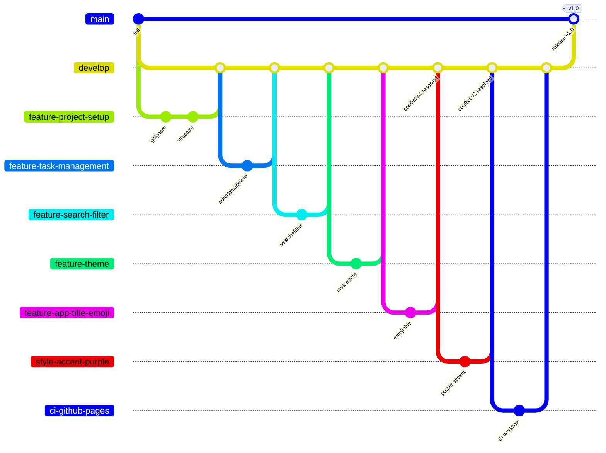

> نکته: به دلیل محدودیت نام‌گذاری در نمودار Mermaid، از خط تیره به جای `/` استفاده شده و شاخه‌های `feature/app-title` و `style/accent-blue` برای خوانایی حذف شده‌اند (این دو شاخه قبل از جفتِ متعارضِ خود به `develop` merge شدند).

---

## 🔀 جدول Pull Request ها

| # | شاخه‌ی مبدأ | مقصد | عنوان | توضیح |
|---|-------------|-------|--------|--------|
| ۱ | `feature/project-setup` | `develop` | feat: project setup | ساختار اولیه و `.gitignore` |
| ۲ | `feature/task-management` | `develop` | feat: task management (add/complete/delete) | منطق اصلی وظایف |
| ۳ | `feature/search-filter` | `develop` | feat: search and filter tasks | جستجو و فیلترها |
| ۴ | `feature/theme` | `develop` | feat: styling and dark mode theme | استایل و حالت تاریک |
| ۵ | `feature/app-title` | `develop` | feat: rename app title to My Task Manager | تغییر عنوان |
| ۶ | `feature/app-title-emoji` | `develop` | feat: add emoji to app title | شامل حل تعارض ۱ |
| ۷ | `style/accent-blue` | `develop` | style: darken accent color for active filter | رنگ آبی |
| ۸ | `style/accent-purple` | `develop` | style: use purple accent for active filter | شامل حل تعارض ۲ |
| ۹ | `ci/github-pages` | `develop` | ci: add GitHub Pages deployment workflow | گردش‌کار CI/CD |
| ۱۰ | `docs/readme` | `develop` | docs: add README | نگارش اولیه README |
| ۱۱ | `develop` | `main` | release: v1.0 | انتشار نهایی و استقرار خودکار |
| ۱۲ | `docs/report` | `develop` | docs: add final report | همین گزارش |

---

## 📜 گزارش کامیت‌ها

- تعداد کل کامیت‌ها: **[تعداد را از خروجی `git rev-list --all --count` وارد کنید]**
- خروجی کامل `git log --all --oneline --graph` در فایل [docs/git-log.txt](docs/git-log.txt) قرار دارد.

### خلاصه‌ی مراحل پیاده‌سازی

1. **راه‌اندازی:** ساخت مخزن با دو remote (گیت‌هاب و همگیت)، ساخت شاخه‌ی `develop` و فعال‌سازی Branch Protection روی `main`.
2. **ساختار اولیه:** افزودن `.gitignore` و اسکلت `index.html`، `css/style.css` و `js/app.js`.
3. **منطق وظایف:** در سه کامیتِ جزئی (Atomic): افزودن وظیفه + ذخیره‌سازی، سپس تکمیل وظیفه، سپس حذف وظیفه.
4. **جستجو و فیلتر:** مارک‌آپ جستجو، منطق فیلتر بر اساس متن، و دکمه‌های All/Active/Done (هر کدام کامیت جدا).
5. **تم و استایل:** استایل پایه، متغیرهای CSS و دکمه‌ی حالت تاریک، و ذخیره‌ی تم در localStorage.
6. **تعارض‌های کنترل‌شده:** دو جفت شاخه که یک خط مشترک را تغییر می‌دادند، برای تمرین حل دستی تعارض (بخش بعد).
7. **CI/CD:** گردش‌کار GitHub Actions برای استقرار خودکار روی GitHub Pages.
8. **مستندسازی:** README و همین گزارش نهایی.

---

## ⚔️ گزارش تعارض‌ها (Merge Conflicts)

### تعارض ۱ — عنوان برنامه (`index.html`)

| مورد | توضیح |
|------|-------|
| شاخه‌های درگیر | `feature/app-title` و `feature/app-title-emoji` |
| فایل | `index.html` (خط `<h1>`) |
| علت | هر دو شاخه از یک نقطه‌ی مشترک از `develop` جدا شدند و **همان خط** را به دو شکل متفاوت تغییر دادند: یکی عنوان را به `My Task Manager` تغییر داد و دیگری ایموجی 📝 اضافه کرد. ابتدا شاخه‌ی اول merge شد؛ سپس هنگام `git merge develop` روی شاخه‌ی دوم، گیت نتوانست به صورت خودکار تصمیم بگیرد. |
| روش حل | حل **دستی**: باز کردن فایل، حذف نشانگرهای تعارض (`<<<<<<<`، `=======`، `>>>>>>>`) و ترکیب هر دو تغییر در یک خط: `<h1>📝 My Task Manager</h1>` |
| کامیت حل تعارض | `merge: resolve title conflict by combining emoji and new title` |


### تعارض ۲ — رنگ تاکیدی (`css/style.css`)

| مورد | توضیح |
|------|-------|
| شاخه‌های درگیر | `style/accent-blue` و `style/accent-purple` |
| فایل | `css/style.css` (قانون `#filter-buttons button.active`) |
| علت | هر دو شاخه **همان قانون CSS** را تغییر دادند: یکی رنگ را به آبی تیره (`#2563eb`) و دیگری به بنفش (`#7c3aed`) تغییر داد. پس از merge شدن شاخه‌ی آبی به `develop`، ادغام `develop` در شاخه‌ی بنفش تعارض ایجاد کرد. |
| روش حل | حل **دستی**: بر خلاف تعارض قبلی که دو تغییر «ترکیب» شدند، این‌بار تصمیم گرفته شد یکی از دو نسخه (بنفش) به عنوان نسخه‌ی نهایی انتخاب شود و نسخه‌ی آبی کنار گذاشته شود. |
| کامیت حل تعارض | `merge: resolve accent color conflict in favor of purple` |


> 💡 این دو تعارض دو الگوی رایج حل تعارض را نشان می‌دهند: **ترکیب هر دو تغییر** (تعارض ۱) و **انتخاب یکی از دو تغییر** (تعارض ۲).

---

## ⚙️ CI/CD — استقرار خودکار با GitHub Actions

فایل گردش‌کار در مسیر [`.github/workflows/deploy.yml`](.github/workflows/deploy.yml) قرار دارد و به این صورت عمل می‌کند:

- **Trigger:** با هر `push` روی شاخه‌ی `main` (یعنی هر بار که یک Release PR از `develop` به `main` merge شود) و همچنین به صورت دستی (`workflow_dispatch`) اجرا می‌شود.
- **مراحل Job:**
  1. `actions/checkout` — دریافت کد مخزن
  2. `actions/configure-pages` — پیکربندی GitHub Pages
  3. `actions/upload-pages-artifact` — بسته‌بندی کل پروژه (چون سایت استاتیک است، مسیر `.` آپلود می‌شود)
  4. `actions/deploy-pages` — استقرار روی GitHub Pages
- در تنظیمات مخزن، منبع Pages روی **GitHub Actions** قرار داده شده است.

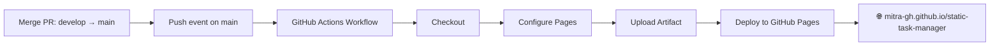


---

## 📚 پاسخ به سوالات نظری

### ۱) پوشه‌ی `.git` چیست، چه چیزی در آن ذخیره می‌شود و با چه دستوری ساخته می‌شود؟

پوشه‌ی `.git` قلب هر مخزن گیت است؛ یک پوشه‌ی مخفی در ریشه‌ی پروژه که **تمام تاریخچه و متادیتای مخزن** در آن نگهداری می‌شود. مهم‌ترین محتویات آن:

- `objects/` — پایگاه‌داده‌ی اشیاء گیت: **کامیت‌ها، درخت‌ها (tree) و بلاب‌ها (blob = محتوای فایل‌ها)** که همگی با هش SHA-1 آدرس‌دهی می‌شوند.
- `refs/` — اشاره‌گرها به کامیت‌ها: شاخه‌ها (`refs/heads`) و شاخه‌های ریموت (`refs/remotes`) و تگ‌ها.
- `HEAD` — مشخص می‌کند الان روی کدام شاخه/کامیت هستیم.
- `index` — همان **Staging Area** (ناحیه‌ی صحنه).
- `config` — تنظیمات مخزن (مثل آدرس remote ها؛ در همین پروژه `origin` و `hamgit` اینجا ذخیره شده‌اند).

این پوشه با دستور `git init` ساخته می‌شود (دستور `git clone` هم در واقع ابتدا آن را می‌سازد و سپس داده‌ها را از ریموت دریافت می‌کند). اگر این پوشه حذف شود، پروژه دیگر مخزن گیت نیست و کل تاریخچه‌ی محلی از بین می‌رود؛ فایل‌های کاری اما باقی می‌مانند.

### ۲) «اتمیک» بودن در Atomic Commit / Atomic Pull Request یعنی چه؟

**اتمیک** یعنی «تجزیه‌ناپذیر»: هر کامیت یا PR باید **دقیقاً یک تغییر منطقی و کامل** را در بر بگیرد — نه کمتر و نه بیشتر.

- **Atomic Commit:** یک کامیت باید یک کار مشخص انجام دهد و پروژه بعد از آن در وضعیت سالم باشد. مثلاً در همین پروژه، منطق وظایف به سه کامیت جدا شکسته شد: «افزودن وظیفه»، «تکمیل وظیفه» و «حذف وظیفه» — به جای یک کامیت بزرگ «کل منطق برنامه».
- **Atomic Pull Request:** یک PR باید یک قابلیت/موضوع واحد را پوشش دهد (مثلاً PR جداگانه برای جستجو/فیلتر و PR جداگانه برای تم).

**مزایا:** بازبینی (Code Review) آسان‌تر، امکان `revert` یا `cherry-pick` کردن یک تغییر مشخص بدون اثر جانبی، تاریخچه‌ی خواناتر، و پیدا کردن سریع‌تر منشأ باگ‌ها (مثلاً با `git bisect`).

### ۳) تفاوت fetch ،pull ،merge ،rebase و cherry-pick

| دستور | کار |
|--------|-----|
| `git fetch` | فقط تغییرات ریموت را **دانلود** می‌کند و `origin/...` را به‌روز می‌کند؛ **هیچ تغییری** در شاخه و فایل‌های محلی نمی‌دهد. |
| `git pull` | معادل `fetch` + `merge` (یا با تنظیم، `fetch` + `rebase`)؛ تغییرات ریموت را دانلود **و** وارد شاخه‌ی فعلی می‌کند. |
| `git merge` | دو خط تاریخچه را با یک **کامیت ادغام (merge commit)** به هم می‌رساند؛ تاریخچه‌ی هر دو حفظ می‌شود. |
| `git rebase` | کامیت‌های شاخه را برمی‌دارد و **روی نوک شاخه‌ی دیگر بازنویسی** می‌کند؛ تاریخچه خطی و تمیز می‌شود اما هش کامیت‌ها عوض می‌شود (بازنویسی تاریخچه). |
| `git cherry-pick` | **یک کامیت مشخص** را از هر جای تاریخچه برمی‌دارد و کپی آن را روی شاخه‌ی فعلی اعمال می‌کند. |

**Merge — تاریخچه‌ی واقعی حفظ می‌شود:**

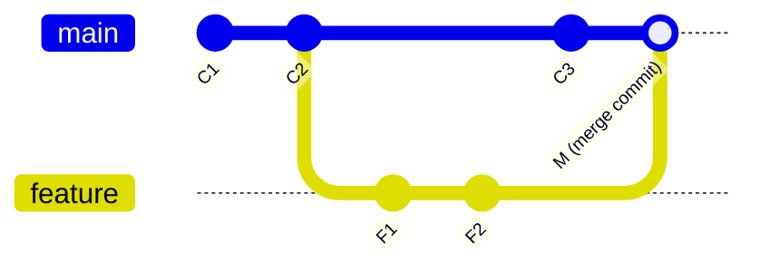

**Rebase — کامیت‌های feature روی نوک main بازنویسی می‌شوند:**

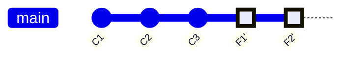

**Cherry-pick — فقط یک کامیت خاص کپی می‌شود:**

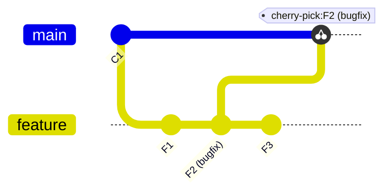

**رابطه‌ی fetch و pull:**

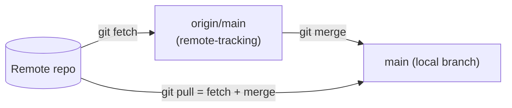

> ⚠️ قانون طلایی rebase: تاریخچه‌ای که push شده و دیگران روی آن کار می‌کنند را rebase نکنید.

### ۴) تفاوت reset ،revert ،restore ،switch و checkout

| دستور | کار | تاریخچه |
|--------|-----|----------|
| `git reset` | اشاره‌گر شاخه (و بسته به حالت، stage و working directory) را به یک کامیت قبلی **برمی‌گرداند**؛ کامیت‌های بعدی از تاریخچه‌ی شاخه حذف می‌شوند. حالت‌ها: `--soft` (فقط HEAD)، `--mixed` (HEAD + stage)، `--hard` (همه چیز). | **بازنویسی می‌کند** ⚠️ |
| `git revert` | یک **کامیت جدید** می‌سازد که اثر یک کامیت قبلی را خنثی می‌کند. | حفظ می‌شود ✅ (مناسب شاخه‌های مشترک) |
| `git restore` | فایل‌ها را برمی‌گرداند: `git restore file` تغییرات working directory را دور می‌ریزد؛ `git restore --staged file` فایل را از stage خارج می‌کند. با شاخه‌ها کاری ندارد. | — |
| `git switch` | فقط برای **جابه‌جایی بین شاخه‌ها** (`git switch develop`) یا ساخت شاخه (`git switch -c new`). | — |
| `git checkout` | دستور قدیمی و چندمنظوره که کار هر دوی `switch` و `restore` را انجام می‌داد؛ به همین دلیل گیج‌کننده بود و گیت آن را به دو دستور جدید شکست. | — |

**Reset در برابر Revert:**

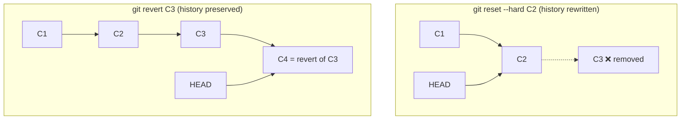

> قاعده‌ی کلی: روی شاخه‌های **عمومی/مشترک** از `revert` استفاده کنید؛ `reset` فقط برای تاریخچه‌ی **محلیِ push نشده** امن است.

### ۵) ناحیه‌ی Stage (Index) چیست؟ دستور stash چه می‌کند؟

گیت سه ناحیه دارد:

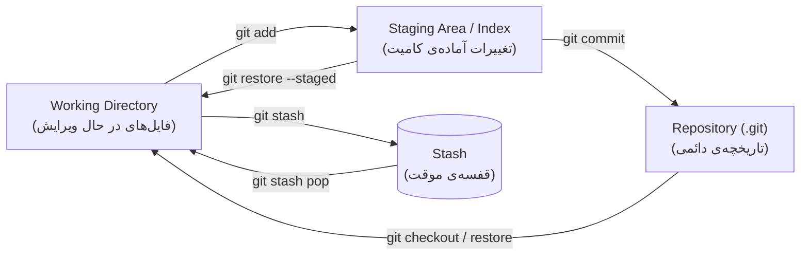

- **Staging Area (Index):** لایه‌ی میانی بین فایل‌های کاری و مخزن. با `git add` تغییرات را «انتخاب» می‌کنیم تا در کامیت بعدی قرار بگیرند. همین لایه است که امکان ساخت **کامیت‌های اتمیک** را می‌دهد: می‌توان فقط بخشی از تغییرات را stage و کامیت کرد.
- **`git stash`:** تغییرات کامیت‌نشده (working directory و stage) را در یک «قفسه‌ی موقت» ذخیره می‌کند و working directory را تمیز می‌کند. کاربرد رایج: وقتی وسط کار هستیم و باید سریع شاخه عوض کنیم بدون این‌که کامیت ناقص بسازیم. با `git stash pop` (اعمال + حذف از قفسه) یا `git stash apply` (فقط اعمال) تغییرات را برمی‌گردانیم.

### ۶) Snapshot چیست و چه رابطه‌ای با کامیت دارد؟

بر خلاف برخی سیستم‌های کنترل نسخه‌ی قدیمی که «تفاوت‌ها (diff)» را ذخیره می‌کردند، گیت در هر کامیت یک **Snapshot (عکس فوری) از وضعیت کامل پروژه** ذخیره می‌کند.

هر **کامیت** در واقع شامل: اشاره‌گر به یک **tree** (تصویر کامل ساختار پوشه‌ها و فایل‌ها در آن لحظه)، اشاره‌گر به **کامیت والد**، و متادیتا (نویسنده، تاریخ، پیام) است. فایل‌هایی که تغییر نکرده‌اند دوباره ذخیره نمی‌شوند — کامیت جدید فقط به **همان اشیاء قبلی** اشاره می‌کند؛ به همین دلیل snapshot ها حجم زیادی نمی‌گیرند.

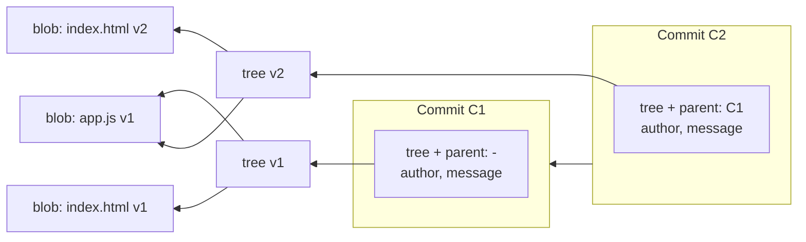

در نمودار بالا، `app.js` بین دو کامیت تغییر نکرده؛ پس هر دو tree به **همان blob** اشاره می‌کنند (بدون کپی مجدد). پس: **کامیت = snapshot + والد + متادیتا**، و تاریخچه‌ی گیت زنجیره‌ای از این snapshot هاست.

### ۷) تفاوت مخزن محلی (Local) و مخزن راه‌دور (Remote)

- **مخزن محلی:** روی کامپیوتر خودمان است (پوشه‌ی `.git`). تقریباً همه‌ی عملیات (commit، branch، merge، log و…) به صورت **آفلاین** روی آن انجام می‌شود و کامل بودن تاریخچه در آن، ویژگی «توزیع‌شده» بودن گیت است.
- **مخزن راه‌دور:** نسخه‌ای از مخزن روی یک سرور (مثل GitHub یا Hamgit) که برای **همگام‌سازی و همکاری تیمی** و همچنین **پشتیبان‌گیری** استفاده می‌شود.

ارتباط این دو با دستورات `clone`، `fetch`، `pull` و `push` برقرار می‌شود. یک مخزن محلی می‌تواند **چند remote** داشته باشد — دقیقاً مثل همین پروژه که هم‌زمان به `origin` (GitHub) و `hamgit` (Hamgit) push می‌شود:

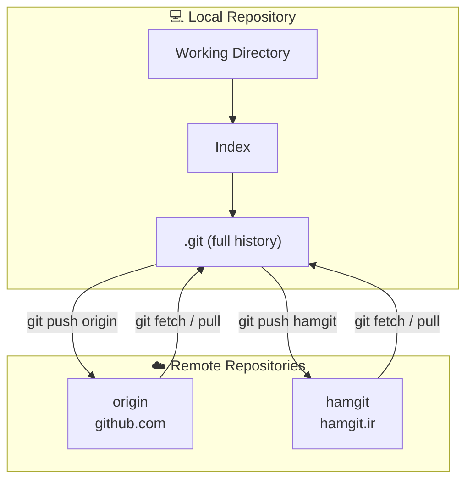

---

## 📖 منابع

- [Pro Git Book — What is Git?](https://git-scm.com/book/en/v2/Getting-Started-What-is-Git%3F)
- [Learn Git Branching (تمرین تعاملی)](https://learngitbranching.js.org/)
````

---

## 🖥️ Commands (run in order)

**1. Create the branch and folders:**

```powershell
git checkout develop
git pull origin develop
git checkout -b docs/report
New-Item -ItemType Directory -Force docs\images
```

**2. Copy your screenshots into `docs\images\`** with these exact names (or edit the README paths):
- `app-light.png`, `app-dark.png`
- `conflict-1-title.png`, `conflict-2-css.png`
- `pages-deploy.png`

**3. Generate the git log file and get the commit count:**

```powershell
git log --all --oneline --graph | Out-File -Encoding utf8 docs\git-log.txt
git rev-list --all --count
```

Paste the count into the README placeholder **[تعداد ...]**.

**4. Replace `README.md` with the content above, then commit granularly:**

```powershell
git add docs/images
git commit -m "docs: add report screenshots"
git add docs/git-log.txt
git commit -m "docs: add full git log output"
git add README.md
git commit -m "docs: add final report in Persian"
git push -u origin docs/report
git push hamgit docs/report
```

**5.** Open PR `docs/report` → `develop` (title: `docs: add final report`), merge, then tell me — we'll do the final release to `main` and verify the deployed site updates.

Send me the output of step 3 (I want to check the commit count) and let me know when the PR is merged.


**User**
The README draft is good, but I need a final polished version. Please revise it with these changes:

1. Tone: make it more formal and academic (it's a university lab report). Remove casual phrases like "قانون طلایی" (golden rule), "قلب هر مخزن" and similar informal expressions — rewrite those points in a neutral, professional tone while keeping the technical content. Keep it in Persian.

2. Fill in the real data:
   - Total commit count: 34
   - Conflict #1 resolution commit hash: 5b62627
   - Conflict #2 resolution commit hash: 88f94ba
   - Add the short hashes to the conflict tables next to the commit messages.

3. In the "گزارش کامیت‌ها" section, you can also reference the actual PR numbers (#1 through #11) since the git log shows them:
   #1 project-setup, #2 task-management, #3 search-filter, #4 theme, #5 app-title, #6 app-title-emoji (conflict 1), #7 accent-blue, #8 accent-purple (conflict 2), #9 ci/github-pages, #10 docs/readme, #11 release develop→main.

4. Keep all the mermaid diagrams as they are (they're good), keep the tables, keep the screenshots paths unchanged.

5. Keep the Resources section.

Give me the complete final README.md ready to paste.


**Claude**
<details>
<summary>Thinking</summary>

I need to finalize the README in Persian with a formal tone, replacing casual language with more professional phrasing, and incorporating the commit data and specific hashes they've provided.…
</details>


**Claude**
Here is the complete final version — ready to paste:

````markdown
# 📝 Static Task Manager — گزارش آزمایش اول آز مهندسی نرم‌افزار

یک برنامه‌ی مدیریت وظایف (Task Manager) که با HTML، CSS و JavaScript خالص (بدون فریم‌ورک و بدون مرحله‌ی Build) پیاده‌سازی شده است. هدف اصلی این آزمایش، تمرین کار با **Git** و **گردش‌کار مبتنی بر شاخه (Branching Workflow)**، شامل کار با چند مخزن راه‌دور، ایجاد و حل تعارض ادغام، و استقرار خودکار بوده است.

## 🔗 لینک‌ها

| مورد | آدرس |
|------|------|
| 🌐 نسخه‌ی مستقر شده (GitHub Pages) | https://mitra-gh.github.io/static-task-manager/ |
| 🐙 مخزن GitHub | https://github.com/mitra-gh/static-task-manager |
| 🇮🇷 مخزن Hamgit | https://hamgit.ir/mitra9595gh/static-task-manager |

---

## ✨ امکانات برنامه

- ➕ افزودن وظیفه‌ی جدید
- ✅ علامت‌گذاری وظیفه به عنوان انجام‌شده (با کلیک روی متن آن)
- 🗑️ حذف وظیفه
- 🔍 جستجوی زنده در متن وظایف
- 🎯 فیلتر وظایف: همه / فعال / انجام‌شده (All / Active / Done)
- 🌙 حالت تاریک (Dark Mode) با دکمه‌ی تغییر تم
- 💾 ذخیره‌سازی وظایف و تمِ انتخابی در `localStorage` مرورگر (با بارگذاری مجدد صفحه حفظ می‌شوند)

### تصاویر برنامه

| حالت روشن | حالت تاریک |
|:---:|:---:|
|  |  |

---

## 🚀 اجرای پروژه به صورت محلی

این پروژه هیچ وابستگی و مرحله‌ی Build ندارد. برای اجرا کافی است مخزن را دریافت کرده و فایل `index.html` را در مرورگر باز کنید:

```bash
git clone git@hamgit.ir:mitra9595gh/static-task-manager.git
cd static-task-manager
```

---

## 🌿 استراتژی شاخه‌بندی (Branching Strategy)

در این پروژه از یک گردش‌کار مبتنی بر **Git Flow** استفاده شده است:

- تغییرات ابتدا روی **شاخه‌های موضوعی** (feature / style / ci / docs) انجام می‌شوند.
- هر شاخه‌ی موضوعی از طریق **Pull Request** به شاخه‌ی `develop` (شاخه‌ی یکپارچه‌سازی) ادغام می‌شود.
- در پایان، `develop` از طریق یک Pull Request نهایی (Release) به `main` ادغام می‌شود.
- شاخه‌ی `main` محافظت‌شده است (Branch Protection): ادغام مستقیم، force push و حذف شاخه روی آن مجاز نیست و تغییرات صرفاً از طریق Pull Request وارد آن می‌شوند.

### جدول شاخه‌ها

| شاخه | نوع | هدف |
|------|-----|-----|
| `main` | اصلی | نسخه‌ی پایدار و قابل انتشار؛ به صورت خودکار روی GitHub Pages مستقر می‌شود |
| `develop` | یکپارچه‌سازی | یکپارچه‌سازی و بررسی تغییرات پیش از انتشار روی `main` |
| `feature/project-setup` | موضوعی | ساختار اولیه‌ی پروژه: `.gitignore` و اسکلت HTML/CSS/JS |
| `feature/task-management` | موضوعی | منطق اصلی: افزودن، تکمیل و حذف وظایف + ذخیره‌سازی در localStorage |
| `feature/search-filter` | موضوعی | جستجوی زنده و دکمه‌های فیلتر All/Active/Done |
| `feature/theme` | موضوعی | استایل‌دهی کامل، متغیرهای CSS و حالت تاریک با ذخیره‌ی تم |
| `feature/app-title` | موضوعی | تغییر عنوان برنامه به «My Task Manager» (طرف اول تعارض ۱) |
| `feature/app-title-emoji` | موضوعی | افزودن ایموجی 📝 به عنوان (طرف دوم تعارض ۱ — تعارض در این شاخه حل شد) |
| `style/accent-blue` | موضوعی | تغییر رنگ تاکیدی فیلتر فعال به آبی تیره (طرف اول تعارض ۲) |
| `style/accent-purple` | موضوعی | تغییر رنگ تاکیدی به بنفش (طرف دوم تعارض ۲ — تعارض در این شاخه حل شد) |
| `ci/github-pages` | موضوعی | افزودن گردش‌کار GitHub Actions برای استقرار خودکار روی GitHub Pages |
| `docs/readme` | موضوعی | نگارش اولیه‌ی README |
| `docs/report` | موضوعی | گزارش نهایی (سند حاضر) |

### نمودار جریان شاخه‌ها (ساده‌شده)


> توضیح: به دلیل محدودیت نام‌گذاری در نمودار Mermaid، از خط تیره به جای `/` استفاده شده است. همچنین شاخه‌های `feature/app-title` و `style/accent-blue` برای حفظ خوانایی نمودار نمایش داده نشده‌اند؛ این دو شاخه پیش از جفتِ متعارضِ خود به `develop` ادغام شدند.

---

## 🔀 جدول Pull Request ها

| PR | شاخه‌ی مبدأ | مقصد | عنوان | توضیح |
|----|-------------|-------|--------|--------|
| #1 | `feature/project-setup` | `develop` | feat: project setup | ساختار اولیه و `.gitignore` |
| #2 | `feature/task-management` | `develop` | feat: task management (add/complete/delete) | منطق اصلی وظایف |
| #3 | `feature/search-filter` | `develop` | feat: search and filter tasks | جستجو و فیلترها |
| #4 | `feature/theme` | `develop` | feat: styling and dark mode theme | استایل و حالت تاریک |
| #5 | `feature/app-title` | `develop` | feat: rename app title to My Task Manager | تغییر عنوان |
| #6 | `feature/app-title-emoji` | `develop` | feat: add emoji to app title | شامل حل تعارض ۱ |
| #7 | `style/accent-blue` | `develop` | style: darken accent color for active filter | رنگ آبی |
| #8 | `style/accent-purple` | `develop` | style: use purple accent for active filter | شامل حل تعارض ۲ |
| #9 | `ci/github-pages` | `develop` | ci: add GitHub Pages deployment workflow | گردش‌کار CI/CD |
| #10 | `docs/readme` | `develop` | docs: add README | نگارش اولیه README |
| #11 | `develop` | `main` | release: v1.0 | انتشار نهایی و استقرار خودکار |
| #12 | `docs/report` | `develop` | docs: add final report | گزارش نهایی (سند حاضر) |

---

## 📜 گزارش کامیت‌ها

- تعداد کل کامیت‌ها: **۳۴**
- خروجی کامل `git log --all --oneline --graph` در فایل [docs/git-log.txt](docs/git-log.txt) قرار دارد.

### خلاصه‌ی مراحل پیاده‌سازی

1. **راه‌اندازی:** ایجاد مخزن با دو remote (گیت‌هاب و همگیت)، ایجاد شاخه‌ی `develop` و فعال‌سازی Branch Protection روی `main`.
2. **ساختار اولیه (PR #1):** افزودن `.gitignore` و اسکلت `index.html`، `css/style.css` و `js/app.js`.
3. **منطق وظایف (PR #2):** در سه کامیت مجزا و اتمیک: افزودن وظیفه و ذخیره‌سازی، تکمیل وظیفه، و حذف وظیفه؛ به همراه استایل اولیه‌ی وظایف انجام‌شده.
4. **جستجو و فیلتر (PR #3):** مارک‌آپ جستجو، منطق فیلتر بر اساس متن، و دکمه‌های All/Active/Done (هر مورد در کامیت جداگانه).
5. **تم و استایل (PR #4):** استایل پایه، متغیرهای CSS و دکمه‌ی حالت تاریک، و ذخیره‌ی تم انتخابی در localStorage.
6. **تعارض‌های کنترل‌شده (PR #5 تا #8):** دو جفت شاخه که یک خط مشترک را تغییر می‌دادند، به منظور تمرین حل دستی تعارض ادغام (شرح در بخش بعد).
7. **CI/CD (PR #9):** گردش‌کار GitHub Actions برای استقرار خودکار روی GitHub Pages.
8. **مستندسازی (PR #10) و انتشار (PR #11):** نگارش README و ادغام نهایی `develop` در `main` که استقرار خودکار را فعال کرد.

---

## ⚔️ گزارش تعارض‌ها (Merge Conflicts)

### تعارض ۱ — عنوان برنامه (`index.html`)

| مورد | توضیح |
|------|-------|
| شاخه‌های درگیر | `feature/app-title` و `feature/app-title-emoji` |
| فایل | `index.html` (خط `<h1>`) |
| علت | هر دو شاخه از یک نقطه‌ی مشترک از `develop` منشعب شدند و **یک خط واحد** را به دو شکل متفاوت تغییر دادند: شاخه‌ی اول عنوان را به `My Task Manager` تغییر داد و شاخه‌ی دوم ایموجی 📝 به آن افزود. پس از ادغام شاخه‌ی اول در `develop`، اجرای `git merge develop` روی شاخه‌ی دوم به تعارض منجر شد، زیرا Git امکان تصمیم‌گیری خودکار میان دو تغییر هم‌پوشان را ندارد. |
| روش حل | حل **دستی**: باز کردن فایل، حذف نشانگرهای تعارض (`<<<<<<<`، `=======`، `>>>>>>>`) و ترکیب هر دو تغییر در یک خط: `<h1>📝 My Task Manager</h1>` |
| کامیت حل تعارض | `5b62627` — `merge: resolve title conflict by combining emoji and new title` |


### تعارض ۲ — رنگ تاکیدی (`css/style.css`)

| مورد | توضیح |
|------|-------|
| شاخه‌های درگیر | `style/accent-blue` و `style/accent-purple` |
| فایل | `css/style.css` (قانون `#filter-buttons button.active`) |
| علت | هر دو شاخه **یک قانون CSS واحد** را تغییر دادند: یکی رنگ را به آبی تیره (`#2563eb`) و دیگری به بنفش (`#7c3aed`) تغییر داد. پس از ادغام شاخه‌ی آبی در `develop`، ادغام `develop` در شاخه‌ی بنفش به تعارض منجر شد. |
| روش حل | حل **دستی**: بر خلاف تعارض قبلی که دو تغییر با یکدیگر ترکیب شدند، در این مورد یکی از دو نسخه (بنفش) به عنوان نسخه‌ی نهایی انتخاب و نسخه‌ی آبی کنار گذاشته شد. |
| کامیت حل تعارض | `88f94ba` — `merge: resolve accent color conflict in favor of purple` |


> این دو تعارض دو الگوی رایج در حل تعارض را نشان می‌دهند: **ترکیب هر دو تغییر** (تعارض ۱) و **انتخاب یکی از دو تغییر** (تعارض ۲).

---

## ⚙️ CI/CD — استقرار خودکار با GitHub Actions

فایل گردش‌کار در مسیر [`.github/workflows/deploy.yml`](.github/workflows/deploy.yml) قرار دارد و به این صورت عمل می‌کند:

- **Trigger:** با هر `push` روی شاخه‌ی `main` (یعنی هر بار که یک Release PR از `develop` به `main` ادغام شود) و همچنین به صورت دستی (`workflow_dispatch`) اجرا می‌شود.
- **مراحل Job:**
  1. `actions/checkout` — دریافت کد مخزن
  2. `actions/configure-pages` — پیکربندی GitHub Pages
  3. `actions/upload-pages-artifact` — بسته‌بندی کل پروژه (از آن‌جا که سایت استاتیک است، مسیر `.` آپلود می‌شود)
  4. `actions/deploy-pages` — استقرار روی GitHub Pages
- در تنظیمات مخزن، منبع Pages بر روی **GitHub Actions** قرار داده شده است.


---

## 📚 پاسخ به سوالات نظری

### ۱) پوشه‌ی `.git` چیست، چه چیزی در آن ذخیره می‌شود و با چه دستوری ساخته می‌شود؟

پوشه‌ی `.git` یک پوشه‌ی مخفی در ریشه‌ی پروژه است که **تمام تاریخچه و متادیتای مخزن** در آن نگهداری می‌شود و وجود آن است که یک پوشه‌ی معمولی را به یک مخزن Git تبدیل می‌کند. مهم‌ترین محتویات آن عبارت‌اند از:

- `objects/` — پایگاه‌داده‌ی اشیاء گیت: **کامیت‌ها، درخت‌ها (tree) و بلاب‌ها (blob = محتوای فایل‌ها)** که همگی با هش SHA-1 آدرس‌دهی می‌شوند.
- `refs/` — اشاره‌گرها به کامیت‌ها: شاخه‌های محلی (`refs/heads`)، شاخه‌های ریموت (`refs/remotes`) و تگ‌ها.
- `HEAD` — مشخص می‌کند مخزن در حال حاضر روی کدام شاخه یا کامیت قرار دارد.
- `index` — همان **Staging Area** (ناحیه‌ی صحنه).
- `config` — تنظیمات مخزن، از جمله آدرس remote ها (در همین پروژه، `origin` و `hamgit` در این فایل تعریف شده‌اند).

این پوشه با دستور `git init` ایجاد می‌شود (دستور `git clone` نیز ابتدا آن را ایجاد و سپس داده‌ها را از مخزن راه‌دور دریافت می‌کند). در صورت حذف این پوشه، کل تاریخچه‌ی محلی از بین می‌رود و پروژه دیگر یک مخزن Git نخواهد بود؛ هرچند فایل‌های کاری باقی می‌مانند.

### ۲) «اتمیک» بودن در Atomic Commit / Atomic Pull Request به چه معناست؟

**اتمیک** به معنای «تجزیه‌ناپذیر» است: هر کامیت یا Pull Request باید **دقیقاً یک تغییر منطقی و کامل** را در بر بگیرد — نه کمتر و نه بیشتر.

- **Atomic Commit:** هر کامیت باید یک کار مشخص را انجام دهد و پروژه پس از اعمال آن در وضعیت سالم و قابل اجرا باقی بماند. برای نمونه در همین پروژه، منطق وظایف به سه کامیت مجزا تقسیم شد: «افزودن وظیفه»، «تکمیل وظیفه» و «حذف وظیفه» — به جای یک کامیت حجیم شامل کل منطق برنامه.
- **Atomic Pull Request:** هر PR باید یک قابلیت یا موضوع واحد را پوشش دهد (برای نمونه، PR جداگانه برای جستجو/فیلتر و PR جداگانه برای تم).

**مزایا:** سهولت بازبینی کد (Code Review)، امکان `revert` یا `cherry-pick` کردن یک تغییر مشخص بدون اثر جانبی، تاریخچه‌ی خواناتر، و یافتن سریع‌تر منشأ خطاها (برای نمونه با `git bisect`).

### ۳) تفاوت fetch ،pull ،merge ،rebase و cherry-pick

| دستور | عملکرد |
|--------|-----|
| `git fetch` | صرفاً تغییرات مخزن راه‌دور را **دانلود** کرده و ارجاع‌های `origin/...` را به‌روزرسانی می‌کند؛ **هیچ تغییری** در شاخه‌ها و فایل‌های محلی ایجاد نمی‌کند. |
| `git pull` | معادل `fetch` به‌همراه `merge` (یا در صورت تنظیم، `fetch` به‌همراه `rebase`)؛ تغییرات راه‌دور را دانلود **و** وارد شاخه‌ی فعلی می‌کند. |
| `git merge` | دو خط تاریخچه را با یک **کامیت ادغام (merge commit)** به یکدیگر متصل می‌کند؛ تاریخچه‌ی هر دو شاخه حفظ می‌شود. |
| `git rebase` | کامیت‌های شاخه را برداشته و **بر روی نوک شاخه‌ی دیگر بازنویسی** می‌کند؛ تاریخچه خطی می‌شود، اما هش کامیت‌ها تغییر می‌کند (بازنویسی تاریخچه). |
| `git cherry-pick` | **یک کامیت مشخص** را از هر نقطه‌ای از تاریخچه برداشته و نسخه‌ای از آن را روی شاخه‌ی فعلی اعمال می‌کند. |

**Merge — تاریخچه‌ی هر دو شاخه حفظ می‌شود:**


**Rebase — کامیت‌های feature روی نوک main بازنویسی می‌شوند:**


**Cherry-pick — تنها یک کامیت مشخص کپی می‌شود:**


**رابطه‌ی fetch و pull:**


> نکته‌ی مهم: بازنویسی تاریخچه‌ای که push شده و سایر افراد بر مبنای آن کار می‌کنند (rebase روی شاخه‌های مشترک) توصیه نمی‌شود، زیرا موجب ناسازگاری تاریخچه‌ی مخازن اعضای تیم می‌شود.

### ۴) تفاوت reset ،revert ،restore ،switch و checkout

| دستور | عملکرد | تاریخچه |
|--------|-----|----------|
| `git reset` | اشاره‌گر شاخه (و بسته به حالت، ناحیه‌ی stage و working directory) را به یک کامیت قبلی **بازمی‌گرداند**؛ کامیت‌های بعدی از تاریخچه‌ی شاخه حذف می‌شوند. حالت‌ها: `--soft` (فقط HEAD)، `--mixed` (HEAD و stage)، `--hard` (هر سه ناحیه). | **بازنویسی می‌شود** ⚠️ |
| `git revert` | یک **کامیت جدید** ایجاد می‌کند که اثر یک کامیت قبلی را خنثی می‌کند. | حفظ می‌شود ✅ (مناسب شاخه‌های مشترک) |
| `git restore` | فایل‌ها را بازمی‌گرداند: `git restore file` تغییرات working directory را حذف می‌کند و `git restore --staged file` فایل را از stage خارج می‌کند. این دستور با شاخه‌ها کاری ندارد. | — |
| `git switch` | صرفاً برای **جابه‌جایی میان شاخه‌ها** (`git switch develop`) یا ایجاد شاخه‌ی جدید (`git switch -c new`). | — |
| `git checkout` | دستور قدیمی و چندمنظوره‌ای که وظایف هر دو دستور `switch` و `restore` را بر عهده داشت؛ به دلیل ابهام در کاربرد، در نسخه‌های جدید Git به دو دستور مجزا تفکیک شد. | — |

**Reset در برابر Revert:**


> جمع‌بندی: بر روی شاخه‌های **عمومی و مشترک** باید از `revert` استفاده شود؛ استفاده از `reset` تنها برای تاریخچه‌ی **محلیِ push نشده** بی‌خطر است.

### ۵) ناحیه‌ی Stage (Index) چیست؟ دستور stash چه می‌کند؟

Git دارای سه ناحیه‌ی اصلی است:

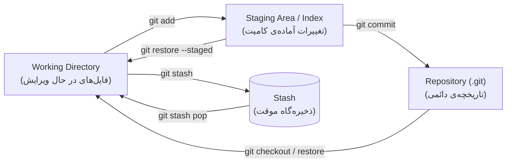

- **Staging Area (Index):** لایه‌ی میانی بین فایل‌های کاری و مخزن. با دستور `git add` تغییرات موردنظر برای کامیت بعدی انتخاب می‌شوند. وجود همین لایه است که امکان ایجاد **کامیت‌های اتمیک** را فراهم می‌کند: می‌توان تنها بخشی از تغییرات را stage و کامیت کرد.
- **`git stash`:** تغییرات کامیت‌نشده (در working directory و stage) را در یک ذخیره‌گاه موقت نگهداری کرده و working directory را به وضعیت پاکیزه بازمی‌گرداند. کاربرد رایج آن زمانی است که در میانه‌ی کار نیاز به تعویض شاخه وجود دارد، بدون آن‌که کامیت ناقصی ایجاد شود. بازگرداندن تغییرات با `git stash pop` (اعمال و حذف از ذخیره‌گاه) یا `git stash apply` (صرفاً اعمال) انجام می‌شود.

### ۶) Snapshot چیست و چه رابطه‌ای با کامیت دارد؟

بر خلاف برخی سیستم‌های کنترل نسخه‌ی قدیمی‌تر که «تفاوت‌ها (diff)» را ذخیره می‌کردند، Git در هر کامیت یک **Snapshot (تصویر لحظه‌ای) از وضعیت کامل پروژه** ذخیره می‌کند.

هر **کامیت** شامل موارد زیر است: اشاره‌گر به یک **tree** (تصویر کامل ساختار پوشه‌ها و فایل‌ها در آن لحظه)، اشاره‌گر به **کامیت والد**، و متادیتا (نویسنده، تاریخ، پیام). فایل‌هایی که تغییر نکرده‌اند مجدداً ذخیره نمی‌شوند — کامیت جدید صرفاً به **همان اشیاء قبلی** ارجاع می‌دهد؛ به همین دلیل ذخیره‌سازی snapshot ها حجم قابل توجهی اشغال نمی‌کند.


در نمودار بالا، فایل `app.js` میان دو کامیت تغییر نکرده است؛ در نتیجه هر دو tree به **یک blob مشترک** ارجاع می‌دهند (بدون کپی مجدد). بنابراین: **کامیت = snapshot + والد + متادیتا**، و تاریخچه‌ی Git زنجیره‌ای از این snapshot هاست.

### ۷) تفاوت مخزن محلی (Local) و مخزن راه‌دور (Remote)

- **مخزن محلی:** بر روی سیستم کاربر قرار دارد (پوشه‌ی `.git`). تقریباً تمام عملیات (commit، branch، merge، log و غیره) به صورت **آفلاین** روی آن انجام می‌شود و کامل بودن تاریخچه در آن، از ویژگی‌های «توزیع‌شده» بودن Git است.
- **مخزن راه‌دور:** نسخه‌ای از مخزن بر روی یک سرور (مانند GitHub یا Hamgit) که برای **همگام‌سازی و همکاری تیمی** و همچنین **پشتیبان‌گیری** استفاده می‌شود.

ارتباط میان این دو با دستورات `clone`، `fetch`، `pull` و `push` برقرار می‌شود. یک مخزن محلی می‌تواند **چند remote** داشته باشد — مانند همین پروژه که به صورت هم‌زمان به `origin` (GitHub) و `hamgit` (Hamgit) push می‌شود:


---

## 📖 منابع

- [Pro Git Book — What is Git?](https://git-scm.com/book/en/v2/Getting-Started-What-is-Git%3F)
- [Learn Git Branching](https://learngitbranching.js.org/)
````

**Changes made:**
- Formal/academic tone throughout: removed «قلب هر مخزن», «قانون طلایی» (now a neutral note explaining *why* shared-history rebase is discouraged), «قفسه‌ی موقت» → «ذخیره‌گاه موقت», «دور می‌ریزد» → «حذف می‌کند», and similar casual phrasing.
- Commit count: **۳۴**; conflict hashes `5b62627` and `88f94ba` added to the conflict tables.
- PR table now uses real numbers (#1–#12) and the implementation summary references them.
- Diagrams, tables, screenshot paths, and Resources unchanged.

Once it's pasted, continue with the commit steps from before (`docs: add final report in Persian`), push to both remotes, and open the PR `docs/report` → `develop`. Tell me when it's merged and we'll do the final release to `main`.


